# Project Write-Up: Countertop — Online Ordering for a Restaurant

> Portfolio write-up. Appended as the build happens, per CLAUDE.md — scaling
> caveats, deliberate simplifications, and defects found go in **as they
> happen**, not reconstructed at the end. A write-up assembled afterwards is a
> write-up with no failure story in it.

**Repo:** https://github.com/shanelabountyai/countertop (private)
**Live demo:** _(Vercel, later)_
**Built with:** Claude Code + Next.js (App Router) · TypeScript · Postgres/Prisma · Tailwind · Vitest/Playwright + axe
**Status:** Complete — 17 backlog items, then 12 more from the left-behind list · 2026-08-25/26

---

## The Business Problem

Phone orders tie up staff during the rush, get transcribed wrong ("no onions"
becomes extra onions), and leave the kitchen with no idea what's coming.
Third-party delivery platforms fix the ordering but take a large cut of every
ticket. Countertop is a fast-casual restaurant's own pickup-ordering flow:
customers compose exactly what they want at a price the server guarantees, and
the kitchen works a live queue that announces itself when a new order lands.

## What I Built

Pickup-only online ordering for one fast-casual restaurant, end to end.

**For the customer:** a menu that renders sold-out items rather than hiding
them; an item composer with required groups, min/max rules, intensity levels
(none / light / regular / extra) and a live price that is explicitly *not* the
authority; a cart that re-prices itself on every read; a checkout that refuses
politely and specifically when the kitchen is paused, closed, or slammed; and a
tokenized status page that follows the order without a login.

**For the kitchen:** a queue grouped by state with tap targets sized for
greasy gloves, elapsed-time flags that escalate, and negations rendered so a
removal can never be read as an addition — the phone-transcription bug this
product exists to kill. A new order chimes and flashes until someone
acknowledges it, and the acknowledgment *is* the `placed → accepted`
transition, so there is no separate accept chore to forget. Every forward tap
has a five-second undo that appends a correction rather than erasing one.
Behind that: item- and option-level 86'ing, a pause switch with an
auto-pause threshold and store hours behind one code path, price editing with
a confirm-on-save that shows old → new, a shared-modifier-group warning that
names every item an edit will touch, and a sales report bucketed in the
restaurant's own calendar.

**The throttle and the quoted wait measure work, not tickets.** Every item
carries a prep weight — a plate off the flat-top is 3, a burrito 2, a bottle
out of the fridge 0 — and the order copies its total weight the way it copies
its prices. The auto-pause threshold and the ready-time estimate both add up
the open orders' weight, so a queue of drinks stops holding the door shut on a
kitchen that is standing empty.

**And a rush that goes wrong on purpose:** `npm run demo:rush` replays thirty
orders through twenty minutes of service including a mid-rush 86 that strands a
cart, a wrong advance and its undo, a no-show aging out, a deliberate
double-submit, and orders bouncing off the pause gate. It is the capstone demo
and a test in the same file.

## The Screens

Every image below is a real screenshot of the running application, captured by
Playwright against the seeded database — `SCREENSHOTS=1 npm run test:e2e --
screenshots.spec.ts` regenerates them. Nothing here is a mockup, and the
numbers on them are the numbers the tests assert.

**The kitchen queue, twelve minutes into the seeded rush.** Twenty-two live
tickets across four states, read on a wall-mounted tablet at arm's length.

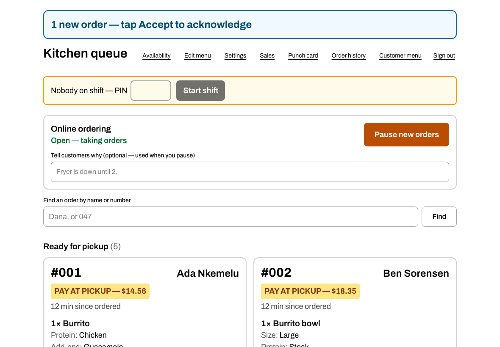

**One ticket, close up — and the reason this product exists.** "NO ONIONS" is a
red badge; "Guacamole" on the same card is plain text. A removal that renders
like an addition is the phone-transcription bug Countertop was built to kill,
and this is the only screen where getting it wrong costs a remake.

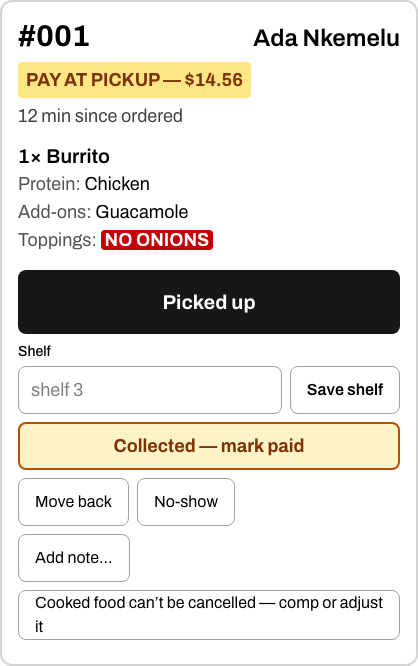

**The same card, with the money still owed.** A customer who chose to pay at
the counter carries the amount on the ticket and one control to clear it. The
flag is order state, not a click that happened in this tab — the second screen
at the counter must not still be showing money owed after someone else
collects it.

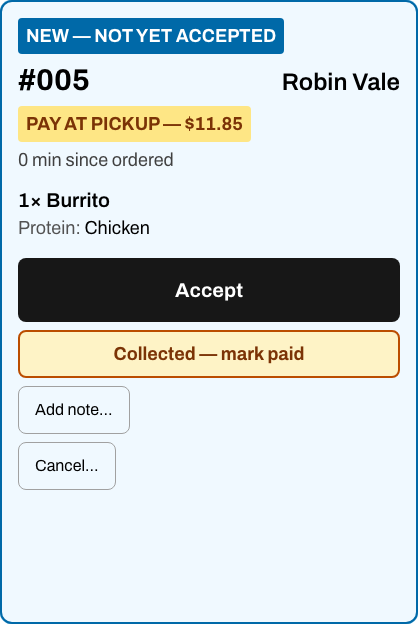

**Yesterday, still open.** Four tickets nobody tapped, flagged with the day
they came from and counted in a banner, so the chore has a size. They are
flagged, never swept: closing an order out is a transition to a terminal state
only the person who was there can pick. They no longer chime, and they no
longer count toward the wait estimate or the auto-pause — which is the bug this
screen exists to have made visible.

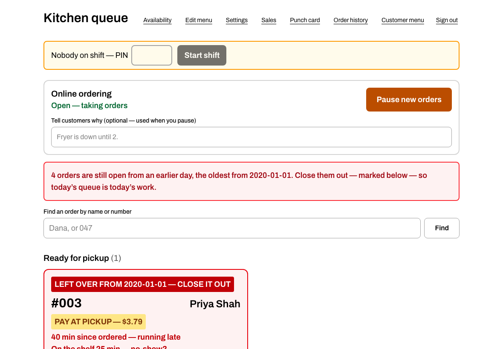

**The item composer.** Required groups, min/max rules, and intensity levels —
none / light / regular / extra — with a live price that is explicitly not the
authority. The server re-prices every line at cart-add and again at placement.

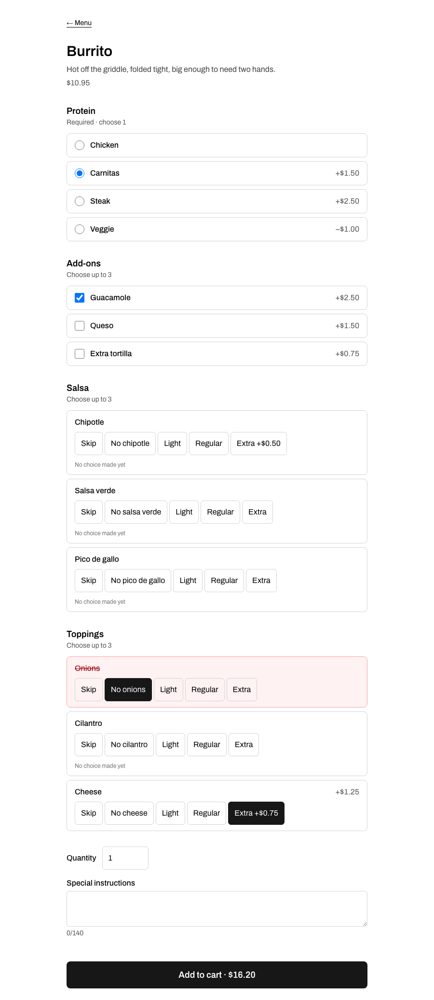

**The sales report, after a full service.** Twenty-eight orders, $478.55, a
3.4% no-show rate over the orders the kitchen actually finished — and a
time-in-state table read off the append-only event log. The 4 h 3 min in
`Preparing` and 1 h 58 min in `Ready` are the same 243 and 118 minutes the
seeded rush's tests hand-tally in a comment.

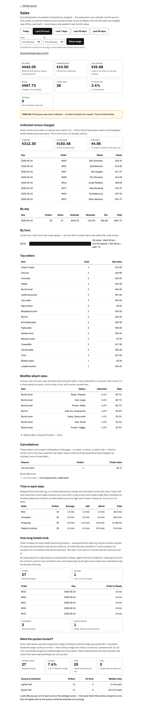

**The same report, mid-service** — and the reason it is worth showing twice.
Nothing has been picked up yet, so revenue is $0.00 and the no-show rate reads
"—" rather than "0%": a rate over zero finished orders is unknown, not zero.
Twenty-two orders are counted as still open rather than quietly missing from
the totals.

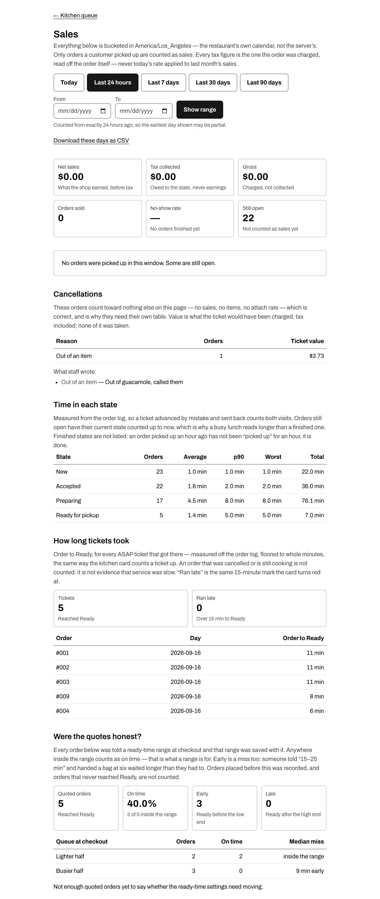

**The price confirm, on a phone.** $10.95 typed as $109.50 is a perfectly valid
price, so no parser catches it — only showing the manager both numbers does.
Since C-026 the value it displays is also checked at save time.


**The operator's settings.** Opening hours, the point at which a queue closes
the door on itself, and the two numbers every estimate is built from.

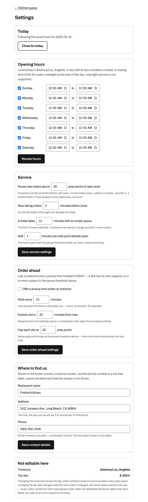

**The staff sign-in.** One shared passcode in front of every `/kitchen` route,
the POSTs included — a screen on the wall behind the till does not want a
per-cook login, it wants the queue to be unreachable from the internet. An
unset passcode means locked, never open.

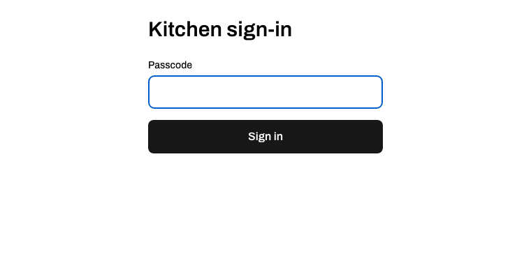

**The customer's side:** the menu, the cart with the negation carried through,
and the tokenized status page.

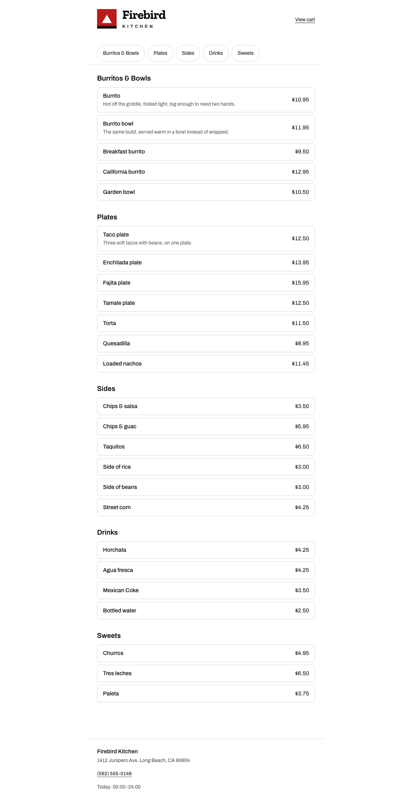

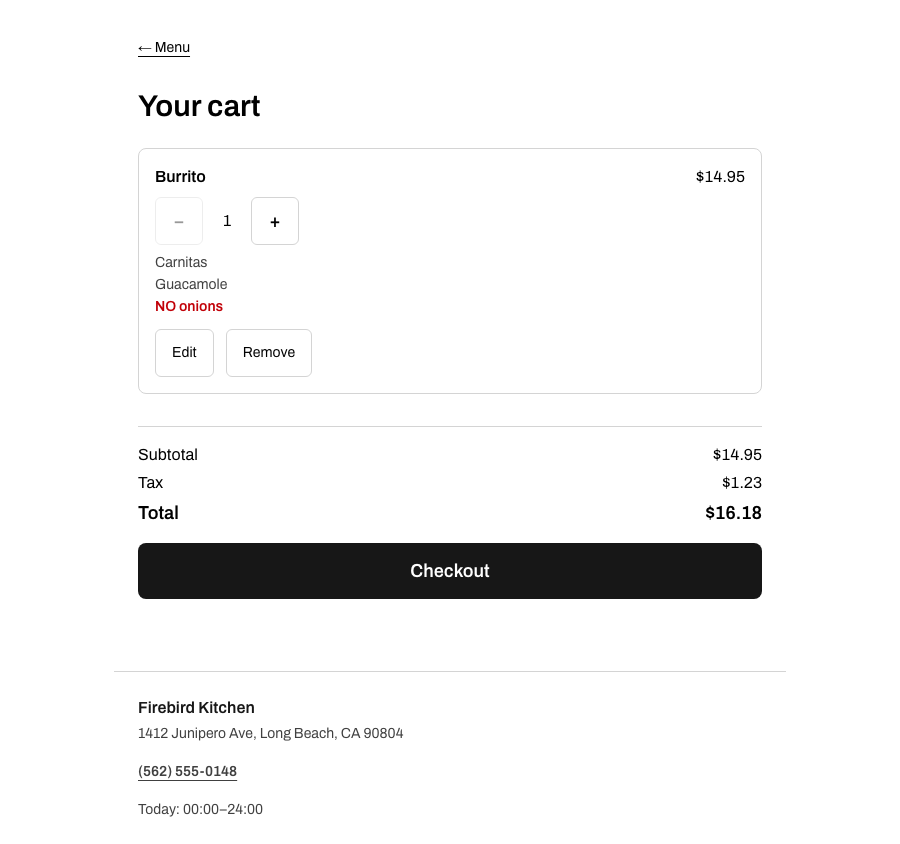

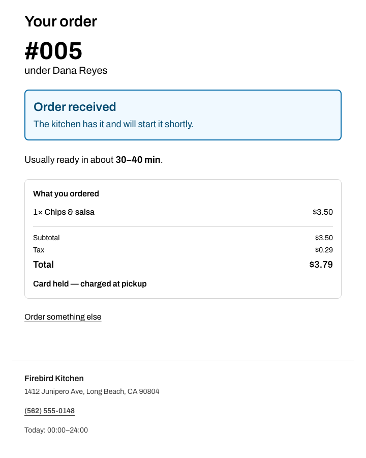

## How It's Built

Three workspaces, and the split is the whole design.

**`packages/core` — pure decisions, no I/O and no clock.** The price engine and
the one orderability function; the order state machine as a single nine-field
table every reader derives its status list from; the checkout gate as one
function with three triggers; the estimate; the business-day and
restaurant-clock conversions; the sales report; the time-in-state tally. Nothing
in here reads `Date.now()` — a lint rule enforces it — so every one of these is
a function you can call with a frozen instant and a hand-written fixture. That
is why 2,738 lines of engine carry 22 test files' worth of arithmetic, and why
twenty minutes of simulated rush runs in under a second.

**`packages/db` — the three things only a database can do.** Take the next
`(businessDay, seq)` without racing (a unique constraint and a retry loop, never
a check-then-write); refuse a second order for the same idempotency key; and
write a status change and its event in one transaction, because a status that
moved without an event is a hole in the history the reports read. Migrations
touching constraints or triggers are hand-written — the order event log's
append-only rule is a Postgres trigger, not a convention.

**`apps/web` — screens that decide nothing.** Every price the customer sees is
recomputed server-side before it means anything; every status list on the
kitchen screen comes from the status module; the checkout button and the
placement writer ask the *same* gate function, so they cannot disagree about
why the door is shut. Live updates are a server-issued cursor the client echoes
back — never the client's clock — polled on a fixed five-second interval that a
WebSocket could replace without touching a line of logic.

**The gate, unchanged for all seventeen items:** `lint && typecheck && test &&
PORT=3400 test:e2e`, with e2e running against a real production build rather
than a dev server. CI applies every migration to a throwaway Postgres from
scratch, checks for schema drift, and runs the unit suite twice — under `TZ=UTC`
and `TZ=Pacific/Kiritimati` — expecting identical results, because the report
bucketing and the order-number reset are exactly what a UTC-only CI would
hide.

**Key design decisions**

| Decision | Alternative considered | Why |
|---|---|---|
| Money is integer cents everywhere, one rounding function | floats, or `Decimal` that becomes a float at the boundary | Float rounding corrupts money math, and it corrupts it quietly — the failure shows up as a receipt that's a cent off, months later |
| A placed order is an immutable **copy** of what it was composed from | foreign keys back to live menu rows | A price edit at 4pm must not change what a 2pm receipt says. If an order row joins a menu table to render, that's the defect |
| The server recomputes every line and the tax at placement | trusting the client's total | Client prices are display-only; a client-supplied total is input to a mismatch log, never to the database |
| A unique constraint on the idempotency key | a disabled submit button | The disabled button is UX. Correctness never depends on the client behaving |
| One status module every reader derives from | status strings inlined at each call site | Adding a state should make the compiler find every reader, not require grep |
| Tax rate as an integer in parts per million | a float percentage, or basis points | A float rate rounds the boundary cent by luck. Basis points cannot express 8.875% (New York) — ppm can |
| Intensity `none` is a selection that does **not** count toward min/max | counting every selection alike | Otherwise "chicken → none" satisfies a required protein group and the burrito ships with no protein in it |
| `min > 0` is what "required" means — no separate flag | a `required` boolean alongside `min`/`max` | Two ways to say one thing is two ways to disagree; `required: true, min: 0` has no meaning and someone writes it eventually |
| Snapshot rows reference the menu by plain string, no foreign key | FK `onDelete: Restrict`, or `SetNull` | Restrict forbids ever deleting a menu row someone ordered; SetNull *edits a placed order*. The ids are for analytics and are never resolved for display |
| Two timestamp columns + the append-only event log | a denormalized column per status | Seven columns can disagree with the log, and a logged revert has to invent a rule about un-setting one |
| No cart tables — client-side cart, server prices every mutation | `Cart` / `CartLine` tables | They would mirror `OrderLine` field for field and need session keying and an expiry job that nothing in P0 reads |
| Every status list is a filter over one nine-field table | status strings written at each reader | Queue filters, the throttle count, the polling stop set and the alert set all have to mean the same thing. A new state is a compile error until all nine questions are answered — the readers cannot be forgotten |
| `ready` is on the kitchen queue but does **not** count as open | one "active" set for both | The food is made: it should keep aging in front of the cooks, but it must not hold the too-busy checkout gate closed |
| `picked_up` and `abandoned` are terminal *and* revertable; `cancelled` is not | no undo past the last state, or undo everywhere | The five-second undo exists for the last tap, which is the one a fat finger gets wrong. Un-cancelling would have to re-charge a refund |
| An advance may carry the state it expects to reach | advance = "whatever comes next" | Two cooks tapping the same card half a second apart otherwise skips a state. The stale tap names a state already behind, and is refused |
| The mock refund is an append-only event | a payment interface with one implementation | The event is the record either way, and an interface with one implementation carries no information. The real adapter is P2 |
| The customer's status page is keyed on an unguessable token | the daily order number, or a name-and-number lookup form | #047 is a counter — a page keyed on it hands out the day's orders to anyone who can count, and a lookup form keyed on a name is the same hole with extra steps |

## Scaling Caveats and Deliberate Simplifications

Recorded as they are made, with the ceiling each one has.

- **Fixed 5-second polling** (P0-5, resolved Open Question). Every open kitchen screen and every customer status page polls on a fixed interval — no backoff when idle. At one restaurant with a handful of screens this is free; it is linear in connected clients, so it is the first thing to change under load. The endpoint is designed as "changes since a server-issued cursor" precisely so a WebSocket upgrade swaps the transport and not the logic.
- **The daily order number resets at midnight restaurant-time**, not at a configurable business-day boundary. A late-night kitchen serving past midnight will see the number reset mid-service. Recorded in the PRD's Open Questions as the accepted v1 simplification.
- **The tax rate is a single flat configurable rate.** Real jurisdictions have category-dependent rates (prepared food vs. packaged). One rate, one rounding function, snapshotted per order.
- ~~**Throttling counts open orders, not prep weight** (P0-6; P1-7 is the upgrade)~~ — **done in C-041.** Every menu item carries an integer prep weight, an order snapshots the sum of its lines' weight times their quantity alongside its money, and both the P0-6 auto-pause threshold and the P0-7 estimate read that sum instead of a row count. Ten bottled waters now weigh nothing and ten fajita plates weigh forty. The remaining ceiling is that weight is per ITEM: a burrito with eight modifiers weighs the same as a plain one, because pricing every option for labour is a model this product does not have. Adding it is an additive field on the option and a second term in one reduce — the same shape the item weight already has. The estimate is still honest about being rough: a range, never a point.
- **`light` intensity costs the same as `regular`** (C-002). Restaurants do not discount light sauce, and inventing a discount rule nobody asked for is a pricing policy smuggled in as a default. If a menu ever needs per-intensity pricing beyond the "extra" surcharge, it is an additive field on the option.
- **No default-included options** (C-002). "NO onions" is expressed as selecting Onions at `none`, not as deselecting something the item ships with. Default-inclusion changes what the composer screen renders and is not in P0-1; adding it later is additive to the group type.
- **The five-second undo window is UI, not engine** (C-004). `applyTransition` allows a revert whenever the transition table does; the button is what expires. Correctness never depends on a client-side timer — same reasoning as the idempotency constraint versus the disabled submit button.
- **Staff can cancel through `preparing`, not only `placed|accepted`** (C-004). The PRD's state line reads `placed|accepted → cancelled`; the wider reading was taken deliberately, because "out of item" — the first reason on the preset list — is usually discovered with the pan already hot. Cancelling food that is already `ready` is still refused: a no-show is `abandoned`, which is a different business signal.
- **The cart is a cookie, not a table** (C-005). It holds compositions and one display-only price, never authority — every total is recomputed server-side from the live menu on each read. The ceiling is the browser's ~4KB cookie limit: `writeCart` refuses over 3,900 bytes and the action returns `cart_full`, because a cookie silently dropped at 4,097 bytes would read as a lost cart. The upgrade, if real carts ever approach it, is a cart table keyed by a session id — not a bigger cookie.
- **An abandoned cart is never cleaned up, because there is nothing to clean** (C-005). No rows, no reaper job, no TTL sweep. The cart dies with the browser session.
- **Caps are per line, not per cart** (C-005). Quantity (20) and note length (140) are enforced on every line; the number of lines is bounded only by the cookie ceiling above.
- **The placement re-check and the placement write are not one transaction** (C-006). `placeOrder` re-prices and re-validates the cart against the live menu, then writes the snapshot; an 86 landing in the milliseconds between the two is snapshotted anyway. Deliberate: that order is indistinguishable from one placed a second *before* the 86, which no isolation level prevents either, and the operational answer already exists — staff cancel it with reason `out_of_item` and the customer sees why. Locking every menu row read at checkout would buy a millisecond off a window that stays open for minutes regardless.
- **The daily order number is `max(seq) + 1`, retried on the unique constraint** (C-006). Not a Postgres sequence, which cannot reset per business day, and not a counter row, which would serialize every checkout behind one lock. The ceiling is contention: each retry costs one extra round trip, and the loop gives up after 25 — which is already a harder simultaneous rush than the P0-6 throttle (default 25 *open* orders) permits. If a restaurant ever exceeds it, the upgrade is a per-day counter row taken with `SELECT … FOR UPDATE`, trading throughput for a bounded retry.
- **Placement trusts that the cart cookie is this customer's cart** (C-006). There is no session identity beyond the httpOnly cookie itself, because a pickup order needs no account. The cart is never accepted as an argument — it is read from the cookie server-side — so the attack it forecloses is "post me a cart with a $0 burrito". What it does not foreclose is someone pasting their own cookie into another browser, which places their own order twice. That is a customer being odd, not a threat.
- **`deepmerge-ts` high-severity advisory accepted, not fixed** (C-001). It arrives only through the Prisma **CLI** (`prisma` → `@prisma/config` → `deepmerge-ts`); the vulnerability is stack exhaustion when merging recursive object graphs, and the only graph merged here is our own committed config. No runtime path, and `npm audit fix` cannot resolve it without an upstream release. Revisit on the next Prisma bump.

- **The deployed demo is a rush frozen at minute 12** (C-045). `rush-demo --until 12` was run once against Neon, anchored so the run *ended* at that moment, which is what makes the queue look like a service in progress rather than a museum. It does not re-anchor: the cards age from that instant forever, so a visitor next month sees the same twenty-two orders, hours old and every aging flag lit. Re-running the seed is a one-line command, and the honest upgrade — if this deployment is ever demoed cold — is a scheduled job that re-runs it. Deliberately not built: a cron to keep a portfolio demo looking fresh is more machinery than the demo is worth.
- **The deployed database is on Neon's free tier, which scales to zero** (C-045). The first request after an idle period pays a cold start on the database as well as the lambda. Nothing in the app compensates — no retry, no warming ping — because a demo that is slow once is fine and a keep-alive job is a bill.
- **The deployment's functions are pinned to `cle1`** (C-045, `apps/web/vercel.json`). Vercel's default region is `iad1` (us-east-1) and the Neon project is in us-east-2, which would put a cross-region hop on every query of every request. The pin is one line and costs nothing; the ceiling is that it is now two facts that must agree, and moving the database without moving the region will be slow rather than broken — the quietest kind of wrong.
- **The composer is not the price authority, and says so twice** (C-007). It renders a live total and disables nothing on the strength of it: every add re-validates and re-prices on the server. The ceiling is that a customer on a stale tab can compose something that was orderable a minute ago — which the server refuses, and the cart flags. The general fix is C-009's polling cursor.
- ~~**The cart offers Remove, not Edit** (C-007)~~ — **done in C-021.** An `Edit` link re-opens the composer pre-filled, and saving goes through `replaceLine`, which keeps the line where it sat. The line id travels in the URL and the composition never does: the server reads what is in that line from the cookie, because a composition in a query string is a composition the client wrote.

- ~~**The kitchen queue has no authentication** (C-008)~~ — **done in C-037.** One shared passcode behind one middleware, which was the whole of the prediction: a server action POSTs to the path it was rendered on, so matching the route matches every write, and a sixteenth action cannot forget to be protected. The cookie is a digest of the passcode rather than a session id, so rotating the variable signs every device out and there is no session table to sweep. Unset means locked, never open — a deploy that forgets the variable loses its queue screen instead of publishing it. The ceiling is that it is one shared passcode: it answers "is this the kitchen?", not "which cook advanced this order?", and the event log's `actor` is still the literal string `staff`. Per-cook accounts are a different project, and the log is where they would have to land.
- **The queue is only as fresh as the last tap** (C-008). Elapsed minutes are computed on the server at render time, so they freeze between renders and an order placed while the screen sits idle does not appear. This is exactly what C-009's server-issued polling cursor fixes, and the screen was built to re-render from state alone so that polling changes nothing but the trigger.
- ~~**`paymentState` never reaches `refunded`** (C-008)~~ — **done in C-038.** Checkout offers a mock card charge or pay-at-pickup, the counter has a `Collected — mark paid` button, and cancelling a paid order now moves the column as well as writing the refund event. The column follows the LOG: `transitions.ts` sets `refunded` when the engine emitted a `refund` event, so there is one place that knows when a cancellation refunds and one that knows what it cost. The remaining ceiling is the other direction — there is no `payment` event kind, so an order collected at the counter carries a state and no instant. A real provider makes that a logged event with a provider reference, and the `refund` kind is the shape to copy.

- **The cursor is the event log's tip, and the poll answers yes/no** (C-009). `queueCursor()` returns `<event count>.<newest event instant>`, and `/api/updates` says only whether that string still matches; it never returns order data. Two consequences, both wanted: a queue card has exactly one renderer (the server component, re-run by `router.refresh()`) instead of a second copy in a client bundle, and a WebSocket upgrade pushes the same payload. The ceiling is the aggregate — a full-table `count()` on the event log every five seconds per open screen. Free at one restaurant's volume; a second location or a shorter interval wants a monotonic sequence column instead.
- **A tip comparison, not a `WHERE at > cursor` range** (C-009). Reading events forward from a timestamp has a lost-update window: a row whose `at` is older than the cursor but which commits after it was issued is never seen. Comparing the tip has no such window — that row still moved the tip. It costs the ability to say *what* changed, which nothing here needs.
- **The queue re-renders once a minute even when nothing changed** (C-009). Elapsed minutes are computed server-side, so a screen that only refreshed on change would print a frozen "12 min" indefinitely. The idle refresh is counted in poll ticks, not in elapsed milliseconds, so no client clock is read; it doubles as the backstop for anything a cursor comparison could miss.
- **Polling has one consumer, and its `active` switch has none yet** (C-009). `LiveUpdates` takes `active` so C-014's status page can pass `!isTerminal(status)` and stop polling a picked-up order, as P0-5 requires. The kitchen queue never stops, so that branch ships untested until the status page exists. The background-tab pause, which P0-5 scopes to the same page, is live on the kitchen screen and asserted there — a queue behind a POS window asks nobody anything.

- **The chime needs a gesture the wall-mounted screen may never get** (C-010). Browsers start an AudioContext suspended until a user interacts with the page, so a queue screen booted at open and left alone is silent by policy, not by bug. The component detects it — it resumes, re-reads `ctx.state`, and renders a "this screen is muted" button when it is still not running — which converts a silent failure into a one-tap-per-page-load chore. The deployment-grade fix is a kiosk browser launched with `--autoplay-policy=no-user-gesture-required`, at which point the button never appears.
- **One banner and one chime, however many orders are waiting** (C-010). The count is announced; the orders are not individually distinguished, and there is no per-order sound. A kitchen with five distinguishable chimes has noise, not information.
- **The chime is synthesised, not an audio asset** (C-010). Two notes on one oscillator: nothing to 404, nothing to decode, and the first order of the day can announce itself before any asset would have loaded. The ceiling is that there is no volume control and no per-restaurant sound — both are settings-screen work, and the first settings surface arrives with C-011's pause switch.
- **The alert is per-screen and client-side** (C-010). A kitchen with no queue screen open hears nothing at all, because nothing server-side pages anyone. P1-3's notification outbox is the place that would change, and it is aimed at the customer rather than the kitchen; a kitchen paging channel is not in P0.
- **No mute, and no dismiss** (C-010). The only thing that stops the chime is `placed → accepted`. This is a deliberate refusal of an obvious affordance: a dismiss button is precisely how an order gets silenced without anyone cooking it, which is the failure P0-12 is named after.

- **One opening window per day** (C-011). `StoreHours.dayOfWeek` is the primary key, so a restaurant with split lunch and dinner service cannot express the gap between them, and a `closeMinute > openMinute` CHECK forecloses overnight service (17:00–02:00) outright. Both are real configurations for real restaurants and neither is modelled. The choice is deliberate: the gate reads these numbers on every checkout, and a second row for a day would make its answer depend on row order, while an overnight window would read as "closed all day, forever" in every branch. Refusing both at write time makes a misconfiguration a loud failure instead of a silent closure. The upgrade is a window table keyed by `(dayOfWeek, openMinute)` with the gate asking "does any window contain now", plus a next-opening walk that spans midnight.
- **The gate has a UI for one of its three triggers** (C-011). The pause switch is on the kitchen screen because pausing is a mid-service action taken with one hand. Store hours, the auto-pause threshold and the pre-close cutoff are columns with defaults and CHECK constraints, changed by a migration or a psql session. That is honest for a P0 whose requirement is that the triggers WORK, but a restaurant cannot change its own hours, which a shipped product plainly needs. C-015's menu-editing screen is the natural home.
- **The seeded restaurant is open round the clock, with a zero-minute cutoff** (C-011). The schema default cutoff is 15 minutes; applied to a 24-hour day it would close the seeded restaurant between 23:45 and midnight, so the e2e suite would pass all day and fail for fifteen minutes before local midnight — and CI runs it under two timezones, so "local midnight" happens twice. Always-open is the only seed configuration independent of the wall-clock hour. The consequence is that the HOURS trigger has no browser test; it is driven directly in `packages/core`, where the clock is a parameter, and the pause switch and the closed-today override carry the e2e side.
- **The auto-pause threshold is not exercised end to end** (C-011). Firing it through the UI needs 25 open orders. It is tested at the database level — placed to the cap, refused, then advanced to `ready` and accepted again — and C-017's seeded rush is where it earns a browser test.
- **The confirmation lives in client state, so a reload loses it** (C-011). The order number, name and totals are rendered from what the placement returned rather than from a URL. A router refresh cannot destroy it any more (the form owns the empty-cart case for exactly that reason), but a manual reload can. The order itself is safe — it is a row, and the status token is printed on the receipt — but the customer would have to find it again. C-014's tokenized status page is the URL this should redirect to, at which point the client state goes away entirely.
- **The gate is asked twice per checkout, not cached** (C-011). The cart page asks, the checkout page asks, and `placeOrder` asks a third time inside the POST. Each is a settings row, a hours read and a `count()` over open orders. That is deliberate — a cached answer is how a paused restaurant keeps taking orders for thirty seconds — and it is three cheap indexed queries at one restaurant's volume. The ceiling is the same `count()` the polling cursor has: a busy multi-location deployment wants the open-order count maintained rather than aggregated.

- **An 86 in a reused group is an 86 everywhere that group is used** (C-012). Guacamole marked sold out is sold out on the burrito and the bowl, because the modifier group is one object referenced by both — which is exactly right when the reason is stock, and wrong when a group is being reused as a menu-structure device rather than as a shared ingredient. There is no per-item availability override, and adding one means availability stops being a property of the option and becomes a property of the (item, option) pair — a second table and a second answer for `validateComposition` to consult. C-015's shared-group warning is the cheaper half: tell the person tapping which items they are about to affect.
- **Nothing restores availability on its own** (C-012). An 86 persists until someone taps it back, across the close and into the next morning's prep. That is the safe direction — food that is back on sells the moment it is marked back on, and nothing sells that is not there — but it means the first stale sold-out badge of the day is a customer's problem before it is anyone's chore. An end-of-day reset is a settings decision (which 86s are "we ran out today" versus "we stopped making this"), and modelling that difference is the real feature, not the cron.
- **The 86 board has no authentication, like the queue** (C-012). Anyone who knows the path can take the whole menu offline. P0 has no staff auth at all, which is a deliberate scope line — the project practises ordering invariants, not session management — but it is the one line that would have to close before this ran in a real restaurant, and the board makes the exposure sharper than the queue did: reading tickets is a privacy problem, 86'ing the menu is a denial-of-service one.
- **A customer's open tab learns about an 86 on its next render** (C-012). The customer surfaces are `force-dynamic`, so every navigation gets the truth, but nothing polls them — the poller is the kitchen's until C-014's status page. Someone sitting on the cart screen while the kitchen 86s their guacamole sees the flag when they move, and `placeOrder` refuses the order in any case. The cost is a wasted trip to the cart, never a bad order; the server is the authority and the screen is the courtesy.

- **The estimate is a shape, not a measurement** (C-013). `base + perOrder × openCount`, widened to a ten-minute range and rounded down to the nearest five. It has never been compared against a single real ticket, because there are none — accuracy is explicitly not a P0 metric (P0-7), and the range exists so the number can be honest without being right. What it cannot see: a twelve-burrito order counts once, the fryer being down does not count at all, and a queue of ten drinks reads exactly like a queue of ten catering bowls. P1-7's prep weight is the first of those; the other two are a kitchen telling the software something it currently has no way to say.
- **The checkout estimate is recalculated per render, not per poll** (C-013). P0-7 asks for recalculation "on each poll", and the checkout page has no poll — it is `force-dynamic`, so every navigation and reload recomputes off a fresh open-order count, and nothing else changes while a customer sits on the page reading it. The polling half of the requirement lands with C-014's status page, which already has the poller (`LiveUpdates`) and the reason to run it.
- **Prep times are columns, not a screen** (C-013). Same shape as the gate's hours and thresholds: `prepBaseMinutes` and `prepPerOrderMinutes` have defaults and CHECK constraints, and changing them means a migration or a psql session. The constraints are what stop the values that break the promise quietly — a negative increment would quote a *shorter* wait the busier the kitchen got — but a restaurant tuning its own prep time is a settings screen, and C-015 is where one appears.

- **One global polling cursor serves every screen** (C-014). The cursor is the tip of the whole append-only event log, so a customer's status page re-renders when a stranger's order advances — thirty open status pages in a rush is thirty wasted server renders per event, each of them a `count()` and a full order read. It is deliberate: the alternative is a per-order cursor, which means the updates endpoint has to resolve a token before it can answer, and the freshness question stops being the one cheap query that a WebSocket can later push verbatim. The upgrade is a monotonic sequence column on `OrderEvent` plus a per-order high-water mark, at which point both the queue and the status page ask the same narrower question.
- **The status estimate is recomputed from the current queue, not frozen at placement** (C-014). A customer quoted "10–20 min" at checkout and four minutes in can be shown "16–26 min" if eight orders landed behind them. That is the honest direction — the food genuinely is further away — but it is a promise that moved, and no screen explains why it moved. Freezing the window at placement would be a countdown that lies instead; the real answer is a kitchen signal the software currently has no way to receive, same ceiling as C-013's. *(C-042 amends half of this: the order now SAVES the window it was quoted, so the report can grade the original promise. The customer's screen still recomputes, deliberately — but the number they see and the number the report grades can now differ, and nothing on either page says so.)*
- **Polling stops at a terminal state, and one terminal state is revertable** (C-014). `isTerminal` is what turns the poller off, and `picked_up` is terminal — but it is also the one terminal state with a `previous`, because the fat-fingered advance needs its undo (C-004). A cook who marks the wrong order picked up and undoes it two seconds later has a customer whose page said "Picked up" and then stopped asking. `cancelled` is the only terminal state with no way back; `picked_up` and `abandoned` both have one, so this covers a mis-tapped pickup and a no-show closed out a minute too early. Keeping the poll alive for a state defined as having no more news would undo the requirement to fix the case it was designed for; the honest fix is the undo writing something the customer's page is told to come back for.
- **The status link has no expiry and no revocation** (C-014). It is 128 bits of randomness with a unique constraint, printed once on the receipt, and it works forever — a link shared, forwarded or left in a browser history is a permanent read handle on a name, a phone number and an order. P1-5 ("status-link hardening") is deferred by decision, so the only mitigation shipped is `robots: { index: false }`, which stops a crawler filing it but stops nothing else. The order data is not sensitive in the way a payment record is, which is why the deferral is defensible and not why it is safe.
- **Lose the link and the order is unreachable from the customer side** (C-014). There is no lookup by name, by phone or by order number — deliberately, because all three are guessable and a lookup form keyed on any of them is the enumeration hole the token exists to close. The customer's recovery path is the counter staff, who have the kitchen queue's name-and-number search. A shipped product sends the link to the phone captured at checkout, which is P1-3's outbox.

- **The editor covers editing, not authoring** (C-015). Prices, group names and group min/max can be changed; nothing can be added, removed or reordered except a modifier group, which can be deleted. That is P0-13's scope read literally — the requirement is about editing *safely*, and adding a row has no destructive-edit problem to solve — but it means the menu's shape still comes from the seed, and a restaurant adding a seasonal item does it in SQL. The confirm-and-warn machinery generalises to authoring unchanged; the missing part is the forms, and the ordering (`sortOrder`) which nothing on this screen exposes.
- **Two managers confirming stale panels: last write wins** (C-015). The confirm panel re-reads the current price on every render, so the old value it shows is genuinely current at render time — but nothing stops a second manager confirming a panel opened before the first one saved. The window is the seconds between tapping review and tapping save, and the loser's change simply disappears with no indication it ever conflicted. A version column on the row and a mismatch check in the action is the fix, and it is the same optimistic-concurrency shape as the placement retry; it is not here because a one-restaurant P0 has one person editing the menu.
- **A price edit reaches open carts silently** (C-015). Unlike an 86, a reprice puts no flag on a cart already holding the item — it does not need to, because `reviewCart` re-prices every line at checkout and the customer sees the new total on the screen where they place the order. Nobody is charged a price they did not see. What nobody is told is that the number *moved*: a cart built at $10.95 and checked out at $12.50 shows $12.50 with no "this went up" beside it, which is honest arithmetic and slightly dishonest UX. The 86 path has the flag because a sold-out line has to be *fixed*; a repriced one only has to be seen.
- **The intensity surcharge is not editable** (C-015). `extraPriceDeltaCents` — what "extra chipotle" adds on top of the option's own delta — is set by the seed and reachable from nowhere in the UI. It is a price, so P0-13 arguably covers it, and the same confirm panel would serve it with no new machinery. It is left out because the editor already carries two grains of price (item base, modifier delta) and a third that only appears on intensity-enabled groups is a row most of the screen would render empty.

- **A renamed item reports as two rows** (C-016). The report groups by the name the order was placed under, because that is the only name it HAS without joining a menu table — and joining one would restate last month's sales under this month's menu, which is the whole thing the snapshot rule forbids. So "Burrito" renamed to "Classic Burrito" splits its own history at the moment of the rename, and no screen explains why. The fix that does not break the rule is to group by the `menuItemId` correlation column and display the most recent snapshot name for it, which merges the rows without reading a menu row — but it makes "which name wins" a decision the report has to defend, and the schema comment is emphatic that those ids are correlation only. Left split, and stated on the page's own terms: every name shown is the name it was sold under.
- **Every report is a full scan of its window** (C-016). `loadReportOrders` pulls each order, line and option in the range and the engine folds them in memory. At one restaurant's volume — a few hundred orders a week — this is a single indexed range read and a few milliseconds of arithmetic, and it buys the property that matters most: the buckets are computed by the same pure function the tests drive, not by SQL that a `date_trunc` in the wrong timezone could quietly get wrong. It is the wrong shape at a chain, and the upgrade is a materialised daily rollup written at the `picked_up` transition, not a better query.
- **Revenue is still what was charged — but the report now says what was collected beside it** (C-016, corrected C-051). The original caveat said `paymentState` exists and the report does not read it, so an unpaid pickup counts as revenue in full. That was defensible at C-016, when no staff screen could even see a payment state; it stopped being defensible at C-038 and C-048, which made pay-at-pickup a common state and gave the shop a durable record of who did not pay while the report went on ignoring it. It was a defect by then, not a simplification, and it is written up as one below. What ships now: revenue keeps its meaning — changing it would restate every past report's headline — and the screen splits it into collected, outstanding and refunded, with the outstanding orders listed by day, number, name and amount. **The remaining ceiling is real and deliberate**: this reconciles the report against itself, not against a till or a processor's settlement, because neither exists in the system and a half-reconciliation is worse than an honest "the drawer is out of scope". Trigger to revisit: the outstanding list stops explaining the variance.
- **A payment has an instant now, and no screen shows it** (C-085). Every payment writes an event — amount, actor, and whether it was taken at checkout or at the counter, which are two different things to reconcile and used to look identical because both were just `paymentState = 'paid'`. What no screen renders is the *when*: paid/unpaid is already on the queue card and the receipt, and the instant exists only in the log. That is deliberate rather than unfinished — PRD 3 builds the payment surface and this is the substrate it needs, and half a payment screen is worse than none. Two other honest gaps in the same shape: `provider: 'mock'` is where a real processor's charge id goes and there is no processor, and nothing joins these instants to C-051's collected/outstanding split, so "what came in between 5 and 9" is still a question the product cannot answer. Also recorded here because it was found rather than known: `time-in-state.ts` claimed the `refund` event carries a null `toStatus` and it does not — the engine gives it the `cancelled` it accompanied. Harmless (a zero-length span, a `Set`-deduplicated visit) and the comment is now correct, but the behaviour is deliberately left for PRD 3 to settle with the rest of the money events, because changing one under an unrelated item is how a small inconsistency becomes a silent report change.
- **Only placement is logged, and nothing counts the lines** (C-084). Every checkout attempt now writes one structured JSON line — placed, refused with every refusal kind and the `GateReason` where the gate was one of them, or threw — correlated by idempotency key and order id, with no customer name, phone or status token anywhere in it by construction. What is *not* logged is everything else: transitions, payment collection, the menu editor's saves. Placement is where the "was this order ever placed?" question starts, which is why P0-1 names it, but a queue action that goes wrong is still invisible. And nothing in the product counts the lines — "the pause bounced eleven orders" is answerable by querying the deployment's log, not by opening a screen. The nearest in-product thing is PRD 1's cancellations-by-reason row, which reads the database and is a different source. Deliberate: a metrics surface over a log is a second product, and the log had to exist before anything could aggregate it.
- **The oldest day in a window is usually partial** (C-016). The window is an instant range — `now` minus 24 hours × N — because turning "the last 30 days in Los Angeles" into a pair of instants is the local → instant conversion that `business-day.ts` refuses to make, a DST boundary having two answers or none. So the query is generous and the bucketing is exact, and the earliest local day shown is a fragment of one. The screen says so in a line rather than letting a half day read as a bad day; the alternative is a local-midnight boundary computed by search, which is a real technique and considerably more machinery than this earns.
- **`instantDaysBefore` is the codebase's only lint exemption** (C-016). The `no-restricted-syntax` ban on `new Date(<expr>)` is blanket by design — its own comment says anything other than `new Date(Date.UTC(...))` stays banned, so that a future test file cannot quietly reintroduce a parse. Subtracting milliseconds from an instant is genuinely safe and the rule cannot see the difference, so the operation went where the rule's own message points: one named function in the restaurant-timezone module, with the exemption scoped to a single line and the reason written beside it. The precedent to resist is a second one.

- **The seeded rush is simulated time, not wall-clock time** (C-017). Twenty minutes of service and a forty-five-minute kitchen tail run in under a second, because every call in the ordering path takes its instant as a parameter. That is the payoff for "nothing in `packages/core` reads the clock", not a workaround for it — a rush that had to run at 1× could not be part of `npm test`. What it does not exercise is anything genuinely temporal: no two writes ever race for real, the poller never runs, and the five-second undo window is never observed expiring. Those have their own tests; the rush proves the ORDER of events, not their pacing.
- **Orders sharing an arrival minute are the only concurrency in the rush** (C-017). Three placements go in together at minute 11 and the double-submit fires two identical requests at once, which is enough to exercise the `(businessDay, seq)` retry loop and the idempotency constraint under real contention. It is not a load test: peak concurrency is three, against a retry loop that gives up at twenty-five. A rush that actually contended for order numbers would need the placements fanned out far wider, and would stop being reproducible.
- **The rush never trips the auto-pause threshold** (C-017). Peak open orders is around sixteen against a shipping default of twenty-five, so the only gate trigger the demo exercises is the manual pause. Deliberate: the script throws on any refusal it did not script, so a rush that started bouncing orders off the throttle would fail loudly rather than quietly deliver twenty-eight and call it thirty — but it means the threshold's own coverage stays in `gate.test.ts` where it can be driven directly.
- **The rush leaves the kitchen queue empty** (C-017). All thirty orders reach a terminal state by minute forty-five, which is the headline result and also means the payoff screen after `npm run demo:rush` is `/kitchen/report`, not `/kitchen`. A variant that stopped at minute twenty would leave a screen full of live cards mid-service; that is a flag on the existing script, not a second one.
- **The time-in-state tally is a function, a test and a line of demo output — not a screen** (C-017). It reads the append-only event log rather than `statusChangedAt`, which is what lets it count a reverted ticket's two visits to `preparing` separately. Putting it on `/kitchen/report` beside the sales numbers is small and nobody has asked for it.
- **The menu grew to twenty-five items by ADDING only** (C-017). Not one of the four original items or six original modifier groups moved, because every hand-calculated price fixture in `packages/core` is priced against those exact rows. Two constraints came out of that and neither is enforced by anything but a note: `salsa` must stay on exactly two items and `fillings` on exactly one, because C-015's shared-group warning asserts those counts by name; and no item name may CONTAIN an existing option name, because Playwright matches accessible names by substring and case-insensitively, so a "Chips & queso" item would make every `Queso` locator in the availability suite ambiguous. The item is called "Chips & guac" for that reason and no other.


- **A leftover is flagged at the business-day line, and that line is midnight restaurant-time** (C-039). "Still open from an earlier day" is the same boundary the daily order numbers reset on — deliberately, because the requirement ties the two together — which means it inherits the midnight caveat two screens up: a venue whose service runs past midnight would see every live ticket flag at 00:00. Not reachable today, because the C-022 store-hours CHECK constraints refuse a `closeMinute` past 1440, so service cannot cross the boundary it is measured against. Marked with a `ponytail:` comment; the upgrade is a service-day offset in settings that `businessDayOf` subtracts, and it fixes both caveats at once.
- **Nothing closes an order out on its own** (C-039). The sweep flags; it never transitions. Closing a leftover means picking a terminal state — `abandoned` for food that was made and never collected, `cancelled` with a reason for a ticket that never got cooked — and only the person who was there knows which. An automatic sweep has to guess, and guessing `abandoned` for an order that was in fact handed over invents a no-show in the P1-1 report. It would also need a `system` actor for a transition the state machine refuses to give one, which is the machine being right. The ceiling is that a restaurant which never looks at its queue accumulates flags forever; the banner counts them, and nothing escalates.
- **`isLeftOver` is written twice, in two dialects** (C-039). Once as a TypeScript predicate for the three readers on the screen, and once as a Prisma `businessDay: { gte: today }` in the open-order count — because the count is a `COUNT(*)`, and doing it in one dialect would mean loading every open order into the app to filter it, which is unbounded exactly when it matters. The where-clause carries a comment naming itself as the predicate's negation. It is the same shape as any query that restates a business rule in SQL, and the mitigation is the same: one db test asserts the two agree.
- **The banner is the only prompt** (C-039). Leftovers are visible when somebody opens the kitchen screen, and not before — there is no notification at opening, no daily digest, nothing that reaches a phone. A shop that opens the screen at 11:05 learns about Tuesday's ticket at 11:05. P1-3's outbox is the shape a real prompt would take.

- **The tuning suggestion is a comparison, not a fit** (C-042). The report splits its samples at the median queue depth and asks whether the busier half missed worse than the lighter half: if it did, the per-unit-of-work increment is too small, and if both halves miss alike, the base prep time is simply wrong. That is two medians where the honest instrument is a two-parameter least-squares fit over (open weight, actual minutes), which would name both numbers at once instead of one. It is not here because thirty orders across a narrow band of queue depths is not enough to fit two parameters against, and a suggestion that swings every service is worse than none — a restaurant that stops believing the number stops reading the screen. Marked with a `ponytail:` comment; the upgrade is the fit, on exactly the same samples, once there are months of them. The second thing it cannot show is a curve: a kitchen that copes fine below a threshold and falls off a cliff above it looks, in two rows, like a kitchen that is uniformly slightly late.
- **Nothing applies the suggestion, and it carries no magnitude** (C-042). The report names a setting and a direction — "raise the base prep time" — and a human types the new number on the C-023 settings screen. Auto-tuning was rejected rather than deferred: a loop that silently moved a customer-facing promise is the thing the operator screen exists to prevent, and it would additionally have to be guarded against tuning itself off its own output, since every order it re-quotes becomes the next round's evidence. The absent magnitude is the smaller call — the honest number is the median miss, and it is already on the table two lines above the sentence, so restating it as "raise it by seven minutes" would read as arithmetic the screen had done for you when it is really a floor.
- **A quote is graded against the LAST `ready`, and the ten-order floor is a blunt one** (C-042). An order advanced by mistake and sent back visited `ready` twice; the correction is the one that counts, because the first was a mis-tap and not a kitchen finishing food. That is right for the undo and wrong for a genuine re-cook — food that went cold on the pass and was made again gets graded against the second attempt, which flatters nobody but does hide the first failure. And the minimum sample count below which nothing is suggested is a flat ten, not a confidence interval: it is the number that stops a restaurant's first four tickets of the week from retuning it, chosen because "not enough to say yet" needed a threshold and any principled one would need a variance the median deliberately throws away.

- **The guard is on the wipe, not on the connection** (C-043). The three scripts that TRUNCATE every table refuse to run against a host that is not this machine, and they read the connection string to decide — never `NODE_ENV`, which is unset in exactly the situation being guarded against, someone running a script by hand at a terminal. What it deliberately does not do is refuse to CONNECT to a remote database: `db:migrate:dev` can reach a cloud host and is meant to, because a deploy has to migrate one. So the standing rule that tests never point at a remote database is still a rule with a mechanism behind only half of it — a remote URL under `npm test` gets caught by the first `resetDatabase()`, which is within a second or two, but it is caught rather than prevented. The ceiling is a script that reads or writes without wiping; there is no such script today, and if one appears the guard is one call to add.
- **The override names the host, and that is the whole design** (C-043). `COUNTERTOP_ALLOW_REMOTE_WIPE` takes the hostname being wiped rather than a boolean, because a blanket `=1` exported once into a shell profile switches the guard off on every machine and in every repo, forever, and would do it silently six months later — which is the accident the guard exists to prevent, arriving through the escape hatch. A value that has to be re-typed per host cannot rot into a default. `PGHOST` is checked as a second, separate target for the same reason the override is narrow: `db:reset:test`'s `dropdb` reads it and never looks at `DATABASE_URL`, so one check would have left the only script that drops a whole database unguarded.

- **History is fifty rows, one day at a time, and never a range** (C-046, narrowed C-049). The search caps at fifty results with no pagination, because a search box that can return every order a restaurant has ever taken is a report wearing a lookup's clothes. C-049 is what makes the cap survivable rather than what removes it: order numbers restart at #001 daily, so a bare number legitimately matches one row per day of service, and before the date filter the row a customer was asking about could sit below the fiftieth. Picking a day cuts the same query to one service. What is still unreachable is anything the two filters cannot express together — every order Dana ever placed, past fifty; a week; "sometime last month". Those are a report's questions, and `/kitchen/report` is where a date range belongs. The upgrade is a cursor on `placedAt`, which the `orderBy` already sorts on.

- **The build now needs the network, and it did not before** (C-087). `next/font/google` downloads Zilla Slab and Archivo at build time and self-hosts them, which is the reason to use it — no request to Google from a customer's browser, no layout shift, no third-party in the critical path. The cost is that `npm run build` is no longer offline-capable on a cold cache. It is fine on Vercel and fine in CI, and it is the one gate step that would fail on a plane. The alternative is committing the font files, which trades a build-time dependency for four binaries in git and a manual update path; recorded rather than taken.
- **The favicon's F is Georgia, not Zilla Slab** (C-087). A webfont cannot be loaded from inside an SVG favicon — the document is fetched in a context with no stylesheet and no font loading — so the `font-family` falls through to the brand's own declared fallback. That is a serif F on brand red everywhere, and never the UI sans the brand forbids, so the rule that matters holds. The exact fix is converting the glyph to a `<path>`, which needs font tooling this repo does not have.
- **The brand stops at the customer's menu screen** (C-087). The item was scoped to assets rather than a redesign, so `/kitchen` and its six sub-screens keep the neutral greys they were built in, and `--color-paper` and `--color-border-black` are defined and unused. The body background is deliberately not set to paper: several pages carry `dark:` classes, and whether this product has a dark mode at all is one of the two calls in `docs/DESIGN_BRIEF.md` still waiting on the owner. Tokens are cheap to define and expensive to define twice; surfaces wait for the answer.

## Defects Found

**C-001 — the drift check could never have passed.** CI's schema-drift step runs
`prisma migrate diff --from-migrations packages/db/prisma/migrations …`. With no
migrations written yet, that directory did not exist, and Prisma fails with
"Could not determine the connector from the migrations directory (missing
`migration_lock.toml`)" — not a clean no-op. Every other gate step was green, so
nothing local pointed at it.

*How it was found:* GitHub Actions refused to run the job (an account billing
block), so the CI steps got executed by hand locally instead of being trusted.
The drift command failed on the first try. Had CI been available, this would
have shipped as a red first run; had CI been available *and* the step been
written to tolerate the error, it would have shipped as a check that silently
verified nothing until C-003.

*Fix:* commit `packages/db/prisma/migrations/migration_lock.toml` with
`provider = "postgresql"` — the file Prisma would have written with the first
migration anyway — so the history has a declared connector from zero migrations
onward.

*What I'd instrument next time:* a CI step that can only pass vacuously is worth
running against an empty repo state before there's anything for it to check.

**C-003 — a lint ban too broad to obey.** The time-axis rules ban `new Date(...)`
with arguments, because `new Date('2026-07-04')` parses through whatever
timezone the server booted in. But the selector also caught
`new Date(Date.UTC(...))` — the one argument form that provably *cannot* read
the process timezone, and the exact way every test builds the frozen instant the
engine takes as a parameter.

*How it was found:* the first database tests failed lint, not assertions.

*Fix:* narrow the selector to exempt that one shape, verified against a probe
file where a string, a bare epoch number, and `Date.UTC(...) + 1000` are all
still rejected. The `packages/core` clock ban was narrowed the same way, to
zero-argument `new Date()` and `Date.now()` — which is what "reads the clock"
actually means.

*Why it mattered more than it looks:* left alone, the workaround was an
`eslint-disable` at the top of every test file from here to the end of the
project. A rule that is routinely disabled is not a rule, and the disable
comment would have quietly covered the real violations too.

**C-007 — the production build could not resolve the domain engine.** Every
relative import inside `packages/core` and `packages/db` was written with an
explicit `.js` extension — `export * from './pricing/index.js'` — the shape
Node's ESM resolver requires and TypeScript's `moduleResolution: "Bundler"`
maps back onto the `.ts` file beside it. `next build` (Turbopack) does not
perform that mapping for a `transpilePackages` workspace. The build failed with
25 × "Module not found: Can't resolve './cart/index.js'".

*How it was found:* the first e2e sweep after the first page that actually
imports `packages/core`. Nothing before C-007 had caught it, because a server
action nothing renders is never bundled — `app/cart/actions.ts` had existed
since C-005 and had never once been compiled. Unit tests, `tsc` and lint were
all green throughout, and stayed green: none of them is a bundler.

*Fix:* drop the extension from every relative specifier that points at a `.ts`
file (real `.js` files, like the generated Prisma client, keep theirs). vitest,
tsx and tsc all resolve extensionless TypeScript, so the extension was buying
nothing that anything in this repo actually used — and it cost the production
build. `next.config.ts` records why, next to the `transpilePackages` line that
makes it matter. Setting Turbopack's `root` to the workspace root was tried
first and changes nothing.

*What I'd instrument next time:* a build is a distinct kind of check from a
type-check, and this repo's gate ran the build only inside the e2e leg — where
a resolution failure surfaces as "webServer was not able to start" three
minutes in. The cheaper signal is a real page importing the engine from the
first session that has an engine, so the bundler has an opinion early.

**C-007 — a control a keyboard could not see.** The intensity pills are
`sr-only` radio inputs inside styled labels. Screen readers were fine — the
markup is a real radio group — but a `:focus` state on an invisible input is an
invisible focus state, so tabbing through the group moved nothing on screen.
Axe reports zero violations for it, because the input is genuinely focusable
and genuinely labelled.

*How it was found:* Playwright timed out clicking one, with "label intercepts
pointer events" — the hidden input cannot be clicked directly, which is exactly
what a sighted mouse user experiences too. That test failure was the visible
end of an invisible problem.

*Fix:* the label carries the ring (`has-[:focus-visible]:ring-2`), and the spec
clicks the label the way a customer does.

*What I'd instrument next time:* an automated a11y pass proves the absence of
some failures, never the presence of usability. A keyboard walk of any screen
with custom-styled inputs belongs in the same session that styles them.

**C-014 — a `goto` that outran the cart it was carrying.** The new status specs
place a real order first, so each one adds a burrito, then navigates to
checkout. One of the five reached an empty checkout and hung waiting for a name
field that was never rendered — and only one, intermittently, which is the
signature of a race rather than a bug.

*How it was found:* the failure alarm on the sweep fired on the inline `✘`
before the run was over, and the saved page snapshot said "Your cart is empty"
in as many words. No stack trace needed reading.

*Fix:* the cart is an httpOnly cookie written by the server action's *response*.
`page.goto('/checkout')` fired immediately after the click races that response,
and a `goto` does not wait for a navigation it did not cause. C-011's own
checkout spec had already solved this — its helper awaits
`expect(page).toHaveURL(/\/cart/)` — and the new helper had quietly reinvented
a worse version of it.

*What I'd instrument next time:* the lesson is not "add a wait", it is that a
second spec file wrote its own copy of an existing helper. A shared
`placeOrder` fixture would have carried the guard for free. The general rule:
after a server action, assert the state it produced before navigating away —
never assume the cookie is on the next request.

**C-015 — the guard bounded the wrong end of the range.** The group editor
refused any save where `max > options.length`, reasoning that "choose up to 4"
of 3 options is a rule nobody can satisfy. It is not: a max above the count is
slack, and the seeded Fillings group ships exactly that — min 2, max 4, three
fillings. The bound that *does* make a group unorderable is a MIN above the
count, which nothing checked. So the screen refused a legal edit and permitted
the illegal one, and the way it announced itself was the e2e case for the
NON-shared group, which never got as far as its assertion because tapping
"Review changes to Fillings" with every field untouched went straight to
"Nothing was changed". A validation rule that rejects the seed's own data is
wrong about the domain, not about the data — and a spec that only exercised the
shared group would have shipped it, because Salsa's 0/3 happens to satisfy both
the right rule and the wrong one.

**C-015 — a `goto` racing a server action reads the value it just replaced.**
The negative-delta spec clicked Save and immediately navigated to the composer,
which faithfully rendered `+$2.50` — the old price — because the navigation
aborted the in-flight POST. It looks exactly like a revalidation bug, and the
temptation is to go widen `revalidateMenuSurfaces`. It was neither: nothing had
been written yet. `status.spec.ts` already carries the same warning about the
cart cookie, one file over. The fix is to assert the outcome the write produces
— the "Saved —" status line — before navigating, which is a better assertion
than the one it replaced anyway: it proves the save happened rather than
inferring it from a later screen.

**C-028 — a demo where every alarm was always on.** C-019 added the ability to
stop the seeded rush mid-service so the kitchen queue has live cards on it, and
anchored the run a flat hour in the past. Stopping twelve minutes in therefore
put the stop forty-eight minutes ago: every card on the queue read as 48+
minutes old, past the fifteen-minute overdue mark, every aging flag lit. A
lunch rush rendered as a disaster.

*How it was found:* writing the e2e that finally looked at the screen (C-028).
Nothing failed — the demo did exactly what it was told — it just showed a queue
nobody would believe.

*Fix:* anchor so minute `until` is NOW. A full run ends now too, which is
better anyway: it lands inside the report's one-day window instead of an hour
before the present for no reason. There is now a test asserting nothing on the
mid-service queue is flagged "Running late".

*Why it is worth recording:* it passed every check, because there was no check.
An aging flag that is always on is worse than no aging flag, and the only thing
that catches "technically correct, obviously wrong" is looking at it — which is
the argument for the screenshot-shaped test, not against it.

**C-026 — the one spec that did not reseed, and the eleven sessions it got away
with it.** `menu.spec.ts` asserts hand-calculated seed prices — "$10.95",
"$13.45" — and was the only spec file with no `reseed()` in a `beforeEach`. The
file that runs immediately before it, `menu-editing.spec.ts`, exists to rewrite
live menu rows. It never broke because that file happened to end on a test
whose own `beforeEach` had just reseeded, so the database was incidentally
clean at the handover.

*How it was found:* three tests appended to the end of `menu-editing.spec.ts`,
the last of which leaves the burrito at $12.50. Four `menu.spec.ts` assertions
failed at once, in a change that had touched neither the menu screen nor the
composer.

*Fix:* `test.beforeEach(reseed)` in `menu.spec.ts`.

*The lesson:* a suite that passes because of the order its files happen to run
in is a suite with a hidden dependency, and the failure it eventually produces
points at the wrong change. What made it invisible is that the incidental clean
state was produced by a `beforeEach` — the right mechanism, in the wrong file.
The general rule: every spec that asserts seeded data must reseed, whether or
not it writes any.

**C-023 — a `'use server'` file may only export async functions.** The settings
actions exported `DAY_NAMES`, a plain const array, alongside them. `tsc`,
ESLint and the whole unit suite were green; `next build` failed with *A "use
server" file can only export async functions, found object*.

*How it was found:* the e2e sweep, where a build failure surfaces as the web
server refusing to start.

*Fix:* the names moved to `packages/core`, which is where they belonged anyway
— the checkout gate already had a private copy of the same seven strings
indexed by the same weekday number, so the constraint pushed a duplicate out of
existence.

*Why it is the same lesson as C-007:* a build is a distinct kind of check from
a type-check, and this repo still runs it only inside the e2e leg. Both times,
the code was merged-quality by every signal available before the bundler was
asked. The cheap fix remains an explicit build step in the gate rather than one
buried three minutes into a Playwright run.

**C-019 — closing a page aborts its own write, the same as navigating away.**
The status spec cancels an order from the kitchen queue in a second tab, closes
that tab, and loads the customer's status page expecting to see `cancelled`. It
saw `placed`: `page.close()` killed the in-flight server action before it
committed. The spec had passed for two sessions on timing alone, and failed on a
run whose diff touched no application code at all.

*How it was found:* the failure alarm on a sweep that was only supposed to
confirm a demo script. The assertion named the received value — `placed` — which
is the whole diagnosis in one word.

*Fix:* assert the write's own receipt before closing. A cancelled order leaves
the queue, so its absence from the kitchen screen proves the transition
committed.

*Why it is worth a third entry:* this is the same defect as C-014's `goto`
outrunning the cart cookie and C-015's `goto` outrunning a price save. The rule
that came out of those — *after a server action, assert the state it produced
before navigating away* — was correct and was written down, and this still
shipped, because nobody had noticed that `page.close()` is a way of navigating
away. A rule phrased around one API does not generalise on its own. The rule is
better stated as: **a server action is not finished until something you can
observe says so, and nothing that ends the page may happen before that.**

**C-017 — nothing. And that is the finding.** The seeded rush is the largest
single piece of behaviour in the project — thirty orders, five deliberately
ugly cases, a hundred and twenty transitions — and fourteen of its fifteen
assertions passed on the first run. The fifteenth failed because the test
asserted a column called `priceDeltaCents` on a snapshot row that actually
carries `appliedDeltaCents`: my typo, in the test, caught by the test.

*Why that is worth recording rather than being smug about:* the rush exercises
concurrency, idempotency, the state machine, the gate, the 86 path and the
snapshot rule all at once, and it found nothing because each of those had
already been driven directly by a test that could isolate a failure to one
function. An integration test that passes first time is evidence the unit tests
were doing their job; an integration test written *first* would have been the
only thing failing, and it would have been the worst possible place to debug
any of it.

### The first clean checkout found the bug the laptop could not (C-036)

CI has never run on this project — every GitHub Actions run since C-029 dies in
three seconds on an account billing block. C-035 rebuilt the CI-only checks as
a local script, and C-036 put a self-hosted runner on the same Mac so that a
push triggers something.

Its first run failed, in a way no local run ever could. The workflow wrote the
runner's env files, ran the from-scratch database script, and the unit suite
inside it died on `PrismaClientInitializationError` — eighteen `packages/db`
tests, all of them connecting to a database that did not exist yet. The step
that creates the runner's database was ordered *after* the step whose tests
connect to it.

On a laptop that ordering is invisible and always will be: `countertop_test`
was created weeks ago and is still there, so the step that "creates" it is a
no-op that happens to be in the wrong place. It fails only where nothing exists
until something makes it — which is the one thing a clean checkout buys, and it
bought it on the first run.

*The uncomfortable part:* the two prior items, C-033 and C-035, were built to
close a verification gap and were themselves verified by exactly the mechanism
that has the gap. The pre-push hook ran, went green, and the push landed a
broken workflow.

Its second run got further and failed on something older than the runner. The
workflow gives the runner port 3450, because it shares a machine with a dev
server and the port table exists precisely so two things never listen on one
port. Playwright waited five minutes at `http://localhost:3450` and timed out —
while the server sat happily on 3400, because `apps/web/package.json` read
`next start -p 3400`. The port was hardcoded in the one script that had to
honour it.

The project convention says the port is "a config default, and `PORT` is still
overridable." It was not overridable; it was frozen. Nothing had ever noticed,
because every caller — the gate, the hook, every local sweep — wanted 3400 and
got 3400. The first caller that wanted a different port was the first one on
this machine that could not have 3400, and the failure it produced was a
five-minute timeout with a healthy server running the whole time.

`next start -p ${PORT:-3400}` in both `dev` and `start`: the default survives,
and the override now does something. Two defects on a runner's first two runs,
both of them things a laptop had structurally agreed not to see.

### A stale row could have held the doors shut (C-039)

Latent since C-011, and found by reading rather than by a failing test. The
P0-6 auto-pause counts orders in `OPEN_STATUSES` — `placed`, `accepted`,
`preparing` — and refuses new checkouts once the count reaches
`maxOpenOrders`, default 25. Nothing in that count knew what day it was.

An order only leaves those statuses when a cook taps a button. Nothing expires
one, nothing sweeps one at close, and until this item nothing on the screen
even distinguished a ticket from last Tuesday from one that was cooking. So
the failure mode was not a crash: it was arithmetic. Twenty-five forgotten
taps, accumulated over any number of weeks, and online ordering refuses every
customer with "the kitchen is at capacity right now" — on a restaurant
standing empty, with nothing on any screen to explain it, and no amount of
cooking able to clear it. Long before that, every stale row silently added its
minute to every quoted wait time, which is the P0-7 estimate lying in exactly
the way the range rule exists to prevent.

Two things kept it theoretical. The seeded rush drains to a terminal state by
minute forty-five, so no test had ever carried a queue across a business day —
the fixtures could not produce the condition. And a real shop would have hit
it slowly, as a wait estimate creeping up by a minute a week, which reads as
the kitchen getting slower rather than as a bug.

The fix is one clause: the count is scoped to `businessDay >= today`. The
screen still shows every leftover, flagged and dated, because excluding a row
from a count without leaving it somewhere visible is how an order disappears
— and the db test asserts both halves in the same case, deliberately, so the
pair cannot be split later.


### The pre-push hook caught a flake, which is the hook working (C-042)

The C-042 push was refused by the pre-push gate: `report.test.ts` failed with
`Hook timed out in 10000ms` — a `beforeEach` exceeding vitest's default hook
timeout, on a test the item had not touched. No assertion was ever wrong; 409
of 410 passed, and the same tree had already gone green through a full gate
minutes earlier (105 e2e passed, 14 skipped, reconciled against 119 listed).

Three back-to-back runs of the same suite under the same `TZ=UTC` all passed
410/410, so it is intermittent rather than a regression. The hook in question
is `resetDatabase()` — a `TRUNCATE ... RESTART IDENTITY CASCADE` over eleven
tables — followed by seeding a twenty-five-item menu, and ten seconds is
vitest's generic default rather than a number anybody chose for a suite whose
every database file opens by taking `ACCESS EXCLUSIVE` on all of them.

It is the same class as the seed/TRUNCATE lock race recorded at C-021, at a
different site: that one was the e2e reseed losing a lock to an in-flight
`/api/updates` poll, this one is the unit suite's own hook. C-021's
left-behind note already names the fix — a lock timeout with a retry — and it
is still not built, because a failure that fires once in five runs and blocks a
push rather than passing one is the cheap direction for this to fail in. What
the episode is worth recording for is the shape of the evidence: an assertion
failure is a defect, a hook timeout is a harness, and telling them apart before
touching the code is what stopped a config change being made to a green suite.

### One failed teardown wedged the runner for every run after it (C-043)

The C-043 push went green through the full gate and the pre-push hook, and its
self-hosted CI run then failed in eleven seconds — at the first step, before a
single test. `dropdb: database "countertop_runner" is being accessed by other
users. DETAIL: There are 16 other sessions using the database.`

Those sessions were C-042's. That run's teardown had failed the same way the
night before, and the reason it *stayed* failed is the ordering inside the
step: it dropped the database first and freed the port second, under
`bash -e`. The served Next.js app on port 3450 is what holds the Prisma pool,
so the drop could not succeed while it was alive — and because the drop failed,
the step aborted and never reached the `kill` that would have released it. A
teardown that leaves behind exactly the condition that made it fail is not a
flake; it is a latch. Every subsequent run failed identically, and would have
kept failing, because each one's own teardown re-armed it.

Two one-line fixes, and the ordering is the real one. The port is freed
*before* the database is dropped, so the thing holding the connections is gone
first; and both `dropdb` calls take `--force`, which terminates whatever is
still attached, so a leaked pool costs the next run nothing instead of
everything. The leaked `next-server` from C-042 was killed by hand once, which
is the only time that should ever be necessary.

Worth recording for the diagnosis rather than the fix: the failure arrived
attached to C-043's commit and named a database, which reads as "the item broke
CI". It was a day-old process on the runner's own machine, and the log line
that settled it — sixteen sessions, on a database the run had not yet created —
was in the first ten lines of the first step.

### Going public turned the CI runner into an attack surface (C-044)

C-044 was scoped as a repository setting. The billing block that has kept
GitHub-hosted CI dead since C-029 lifts for public repos, the history had been
audited at C-042 and was clean, and the item read as: flip the switch, watch a
run go green.

The secret audit was the part everyone expects, and it found nothing — one
`.env.example` with names and no values, four connection strings that are all
either a container GitHub destroys with the job or a deliberately fake Neon
hostname in the test that asserts hosted databases get refused. That is the
check the convention asks for, and it passed.

The thing the item did not ask about was the runner. `ci-self-hosted.yml` has
`runs-on: [self-hosted, macOS]`, and it had been firing on every push for eight
items. What that line means is: check out this repository and execute its code
on the developer's own laptop. On a private repo that is fine by construction —
the only people who can put code in the repository are people already trusted
with the machine. Public breaks that equivalence. Anyone can fork a public repo
and open a pull request, and a workflow that a pull request can trigger is a
stranger choosing what commands run on a laptop that also holds four other
projects' databases.

Nothing here was ever exploitable. The workflow's triggers were `push` to
`main` and `workflow_dispatch`, and neither is reachable from a fork — GitHub
runs fork pull requests against the base repo's workflows without granting
them the fork's triggers. So the honest description is not "a vulnerability was
found", it is that the safety of the arrangement rested entirely on two lines
in a file, and after the visibility flip those two lines are load-bearing in a
way nobody reading the file would guess. The next session to add
`pull_request:` to that workflow for a perfectly good reason would have been
right about the reason and wrong about the consequence.

The fix is deregistering the runner and reducing the workflow to
`workflow_dispatch`, which is reachable only with write access. The recipe
stays in the file, because retiring something as a dependency is not the same
as deleting what it knew, and the header now names the hazard in the
imperative — addressed to a future editor rather than describing the past.

What is worth recording is the shape of the miss. A backlog item written three
days earlier said "public repos get free minutes, history is clean, flip it",
and both of those clauses were true. Neither was the question. A change of
visibility is a change in *who can propose code*, and every mechanism that
silently assumed the old answer had to be re-read under the new one — of which
the runner was one, and the only one, but it was not in the item's text.

The repo was returned to private half an hour later, and the postscript is the
better half of the lesson. The runner came back on, correctly — private makes
it safe by exactly the construction that public breaks. But the comment written
into the workflow an hour earlier said *this repo is public, never add a
fork-reachable trigger*, and that sentence was already false. It described the
world rather than the condition, so it aged into confident misdirection the
moment the world moved, and the next reader would have had no way to tell.
Rewritten, it names the dependency instead: if this repo is ever made public
again, remove the push trigger and deregister the runner. The first version
would have been wrong and unfalsifiable; the second is checkable against a
setting anyone can read.

The other thing the half hour bought was a measurement. `ci.yml` had been
written at C-029 and had never executed a step — every run died in four seconds
on billing. Given free minutes it went green twice, on Node 22 and then Node
24, e2e reconciling 105 passed and 14 skipped against 119 listed. Nineteen
items of "CI is correct, it just cannot run" turned out to be true, which was
not knowable before and is not unknowable again just because the repo went
back.


### The exact hazard C-044 named came back, unattended (2026-08-31)

The repo went public again at some point around 2026-08-29 — deliberately,
this time, for the free GitHub-hosted minutes `ci.yml` had already proven it
could use — and stayed public. `ci.yml` ran green on every push from then on;
the memory note and C-044's own commit message both still say "repo private
again," because the flip back to public was never recorded anywhere a future
session would read before trusting the old state.

What C-044 named as the actual load-bearing fact — visibility, not the
repo setting alone — was checked against the description in the docs, not
against the account. `gh repo view` said `PUBLIC`. `ci-self-hosted.yml` still
had its `push:` trigger live and the runner was still running as a launchd
service, both exactly as C-044's header comment says to undo "if this repo is
ever made public again." For two days, that condition was true and the
undo had not happened.

Found by treating a stale memory note as a claim to verify rather than a fact
to build on, the same instinct the docs themselves ask for. Fixed the same way
C-044 did the first time: `svc.sh stop`/`uninstall`, `config.sh remove` against
a fresh removal token, `push:` deleted from the workflow, `workflow_dispatch`
left as the only trigger. The user's call this time was to keep the repo
public rather than revert it — `ci.yml` is the real CI now, and the
self-hosted recipe stays in the file, dormant, for if that ever changes back.

The lesson isn't the runner twice. It's that "repo private again" was written
down as a fact rather than a decision with a re-check attached, and a decision
that can silently drift — someone flips a GitHub setting outside any commit —
needs the thing that depends on it to check the setting itself, not the note
that once described it. A dated correction here doesn't stop the next drift;
it's the same class of unfalsifiable-over-time problem C-044 already
diagnosed, just one layer up — this time in the record of the decision rather
than in the workflow file.


### The Prisma client could not find its own engine, but only when deployed (C-045)

The first deploy of C-045 built cleanly, served the home page, and returned 500
on every page that reads the database. `Prisma Client could not locate the
Query Engine for runtime "rhel-openssl-3.0.x"`.

The obvious readings were both wrong. The first is "the Linux engine was never
generated" — but Vercel's build log showed `prisma generate` running, and on a
Linux builder `native` *is* `rhel-openssl-3.0.x`, so the file existed. The
second is "Next did not trace the binary into the lambda" — the documented fix
is `outputFileTracingIncludes`, that was added, and the local trace manifest
did list the engine. Redeploying changed nothing at all.

The answer was one line in the build log, four lines below a warning nobody
reads: `config.isBundled = true`. Turbopack had bundled the Prisma client into
a Next chunk. A bundled client has no directory of its own, so the engine
lookup — which resolves the `.so` relative to the module's own location — had
nothing to resolve against, and fell back to guessing at paths that do not
exist. Tracing the file in was never going to help; the file was probably
there. The code looking for it had lost the ability to say where "there" is.

Which made the fix a one-word question: why is Prisma being bundled at all?
Next has `serverExternalPackages` for exactly this, and it takes package names.
This repo generated its client to `packages/db/generated/client` and imported
it by relative path — and a relative path has no package name to exclude. The
custom output location, chosen so the generated client would sit beside the
schema, was the thing that made the client unexcludable.

So the output went back to Prisma's default. The client became `@prisma/client`
— an ordinary package name — `serverExternalPackages` names it, Turbopack
leaves it alone, and it loads its engine from its own directory like any other
Node module. The `binaryTargets` and `outputFileTracingIncludes` added while
chasing the symptom were both reverted, because neither was doing anything.

The reason this cost three deploys is that it cannot fail locally, in either
direction. `next dev` does not bundle server dependencies, and the e2e
production build runs on the same machine that generated the engine, where the
file is simply already sitting where any guess would find it. The whole gate
was green through every one of those failed deploys, and would be green today
if the fix had never been made.

### Exploratory testing found six gaps the automated suite never covered (post-C-046)

Three agents drove the live, deployed app black-box — one as a customer, one
as kitchen staff, one as admin — alongside the existing Playwright suite. The
suite was green throughout; nothing below is a regression it should have
caught, because none of it was under test.

- **The checkout gate only asked itself at checkout.** Manual pause,
  auto-pause, and closed-today were invisible on `/menu` — only `/cart`
  called `currentGate()`. A customer could build an entire order before
  finding out it couldn't be placed. `/menu` now asks the same gate and
  shows the same `GateNotice`.
- **The screen right before paying dropped every modifier and negation.**
  Checkout's review and the order-confirmation receipt rendered
  `"1 x Burrito — $12.20"` — no options, no "NO onions" — even though the
  cart page one screen earlier, and the status page one screen later, both
  show them in full. Negations are this app's founding invariant, and this
  is exactly the screen a wrong negation has to be caught on.
- **A stale or rejected queue action gave staff no feedback.** Two tabs
  racing on one order correctly protected the order's state, but `run()`
  called `revalidatePath('/kitchen')` unconditionally — re-rendering the
  whole queue inside the same transition, which could remount
  `<QueueControls>` into a different status section before the just-set
  error was ever visible. Now it revalidates only on an actual state
  change.
- **The kitchen header's own nav failed this app's tap-target rule.**
  "Availability", "Edit menu", "Settings", "Sales", "Customer menu" measured
  ~20px — under the 48px bar the queue's own cards are held to, and
  "Availability" is the exact page used to 86 an item mid-rush, not a
  rarely-tapped exception. Nothing had previously measured header `<a>`
  elements, only `<button>`/`<summary>`; the regression check in
  `kitchen.spec.ts` now does.
- **The item composer let a bad quantity reach the price preview.** Typing
  0, a negative number, or over the 20-item max flowed straight into the
  live total — a negative or nonsensical price — before the server ever
  refused it at submit. Clamped at the input instead.
- **Checkout showed a flag existed but not which line it was on.** The
  order-summary line rendered `{ line, priced }` from `reviewCart` but never
  read that same line's `problems` (an 86'd option/item) or `priceChange` (a
  reprice while the item sat in the cart) — both already computed, both
  already rendered per-line on `/cart`. Checkout showed only a generic
  bottom banner, so a customer with more than one line — or one who lands on
  checkout directly — had to go back to the cart to find which line was the
  problem. Same fix shape as the modifiers gap above: render what
  `reviewCart` already computed, on the screen that's supposed to be the
  last chance to catch it.

Two other findings from the same pass were false leads, left unfixed: a
"quantity 999 prices at $99,890.01" report turned out to be a different agent
legitimately repricing the seeded item mid-test, not a pricing bug; and a
settings-page checkbox measuring 20px alone is wrapped in a `min-h-12
<label>` that is the real tap target.

*What this says about coverage, not just these six bugs:* every one of them
sat on a screen the automated suite already had tests for — checkout, the
queue, the composer, the header — just not testing *this* path through it.
Black-box exploratory passes and a green Playwright suite are finding
different classes of gap, and the deployed app is what surfaced these; none
of them needed the database seed changed to reproduce.

### The engine was right and the screen never asked (C-047)

A second exploratory pass, same method as the one before it. The most
interesting thing it found is not a bug in the usual sense — nothing was
mis-implemented, no test was wrong, and every line involved was deliberate.

`STATUS_FACTS.picked_up.previous` is `'ready'`. The comment above it says
"terminal, but still revertable: the fat-fingered advance needs its undo".
`abandoned.previous` is `'ready'` for the same reason. `undoRemainingMs`
computes a real five-second countdown for both, off the append-only event log
rather than a client flag, specifically so that a card moving between sections
or a page being reloaded cannot lose the undo the cook is reaching for. There
is a unit test for that. There is a comment explaining why it is derived from
the log. All of it is correct.

And none of it was reachable, because `picked_up` and `abandoned` are
`inQueue: false`, `loadQueue()` selects `QUEUE_STATUSES`, and the kitchen page
renders what `loadQueue()` returns. The tap that starts the countdown is the
same tap that stops the card being drawn. Marking the wrong order picked up
was, until this session, permanently unrecoverable through any staff screen —
the exact scenario the `previous` field exists for.

What makes this worth writing down is how invisible it was to every check this
project has. The engine's tests pass because the engine is right. The queue's
tests pass because the queue does what it says. The e2e suite tests undo on
`placed → accepted`, where the card stays in the queue and the button is
there. Nothing tested the *seam*: a domain fact that is true and a screen that
never asks the question. Two correct halves, and the defect lives in the space
between them, where no unit test looks and no integration test had a reason
to.

The fix derives the list rather than naming it — `UNDOABLE_EXIT_STATUSES` is
every status that leaves the queue while still having a `previous`, computed
from `STATUS_FACTS` — so the next state with this shape joins the strip by
existing. That is the same discipline as the rest of the status module, and it
is the only reason this is a small change: the question "which states have an
undo the queue cannot draw?" turns out to be answerable in one expression.

**Three others from the same pass, each a screen not asking a question it had
already computed:**

- **Checkout refused an order without the screen catching up.** A cart emptied
  in another tab, an 86, a reprice, the gate shutting — the server refused all
  of them correctly, and the summary, the estimate and the enabled "Place
  order — $11.85" button all stayed exactly as rendered, because they come
  from the server component *around* the client form and nothing told it to
  re-run. The customer read a complete order and "your cart is empty" at the
  same time. One `router.refresh()` on refusal, which is the whole class, not
  the one path. The same edit swapped `action` for `onSubmit`, because React
  resets a form after an action resolves — which on a refusal threw away the
  name they had just typed.
- **A typed `%` in the staff history search matched every order ever taken.**
  `contains` compiles to SQL `LIKE`, and Prisma passes the term through
  unescaped. Verified against real Postgres in both directions rather than
  reasoned about: 4 of 4 before, 0 of 4 after, with `Dana` still matching 1.
- **Six back-links at 17px, in a codebase whose queue cards are held to 48.**
  Plus the header nav, which had been fixed for *height* in the previous pass
  and not for width — "Sales", the shortest label, was a 35px-wide target. A
  rule that is checked in one dimension is a rule that is half enforced.

*The cost of finding these:* three agents, of which one died partway through
on an account rate limit, taking the whole admin/config lane with it. Menu
editing, 86-propagation across its three surfaces, and the report's timezone
bucketing got no black-box pass this session. They have dedicated e2e specs
and those specs are green, which is exactly the assurance the four findings
above also had.

*And one cost paid to my own test:* the closeout spec asserted "`abandoned` is
not a queue status, so the card leaves the screen entirely." True when
written, and made deliberately false by this change. The alarm on the sweep
caught it in the second minute; the assertion was rewritten to say what now
matters — out of the queue, into the strip — rather than relaxed to pass.
### `unpaid` is two different facts (C-048)

The defect C-047 wrote down and did not fix: the collect control lived only on
a queue card, so an order handed over without collecting became permanently
uncollectable the moment it left the queue.

The obvious fix is to put the same button on the staff receipt, and the
obvious condition is the one the queue card already used —
`paymentState === 'unpaid'`. That would have shipped a button offering to
collect money on a no-show.

`unpaid` on an order in flight, or one that was picked up, is a debt. `unpaid`
on a `cancelled` or `abandoned` order is a *completed fact*: nobody took the
food, nobody owes anything, and marking it paid would book revenue against
exactly the orders the no-show rate is counted from. Same column, same value,
opposite meaning — and which one it is is decided by the status, which is to
say by the module this project has spent forty-odd items keeping as the single
answer to questions like this. `canCollectPayment` reads `salesRole` and both
screens and the server action ask it.

Writing it that way immediately found a bug C-047 had itself introduced a day
earlier. The new "Just finished" strip renders `QueueControls` for a finished
order, `QueueControls` tested `paymentState === 'unpaid'` directly, and an
abandoned order therefore sat in the strip offering to collect. One predicate,
two call sites, and the second one was already wrong — which is the argument
for the predicate, made by the codebase rather than by me.

### What a clean exploratory pass is worth (C-048)

C-047's admin lane died on a rate limit and its whole surface went untested.
Re-run alone on the app, it returned one defect — four more 21px back-links —
and a long list of things that are right.

That list is the more useful half. 86'ing a shared modifier option showed
"sold out" rather than hiding it, flagged an open cart on both `/cart` and
`/checkout`, was refused server-side when the disabled button was re-enabled
by hand, and was invisible to an order already placed — verified on the
kitchen card, the staff receipt *and* the customer's status page. A live
reprice, a unicode group rename with its shared-group warning, the
stale-confirm guard, close-before-open hours, negative and absurd prices,
blank-versus-$0.00 on an intensity surcharge, all three gate triggers with the
estimate correctly absent while paused, and the report's zero-data path: all
behaved. Those are this project's founding invariants, and nothing about a
green unit suite proves them end to end through real screens.

The one defect is the same one for the third time. The header nav was fixed
for height and not width; the two order-history back links were 17px; these
four were 21px. Every instance was on a page whose own buttons were fine,
because until now nothing had ever measured a `<Link>` outside the queue. The
fix that ends it is not a fifth edit — it is the loop that now walks every
staff screen and measures the way back.

*Also noted, honestly:* the report's timezone bucketing has been declined by
both exploratory rounds for the same real reason — it needs the server's wall
clock moved, which destabilises a shared environment. CI running the unit
suite under `TZ=UTC` and `TZ=Pacific/Kiritimati` is the assurance that
actually covers it, which is why that leg exists.

### The refusal that no screen ever asked for (C-050)

Second-pass evaluation, defect D1, and the same sentence as C-047 with
different nouns.

`applyTransition` has carried an `unexpected_target` refusal since C-004, with
a comment naming exactly the case it is for: two cooks tapping the same card,
the second tap naming a target that is already behind. It fires on
`action.to !== undefined && action.to !== to`. Neither real caller ever passed
a `to`. The guard could not fire from a screen and never had.

The database's compare-and-set looked like the same protection and is not. It
catches two taps racing on the *same* read; it re-reads current status first,
so a tap from a card five seconds stale advanced the order from wherever it
had since got to. Two screens on one board is the ordinary kitchen setup, and
a five-second poll made the button labelled "Start cooking" mark an order
picked up — bag on the pass, customer told at the counter it was collected.

The state machine's own suite asserts the refusal thoroughly, by reason, and
passed throughout: the engine was always right. Nothing asserted that the
*screen* asks for it. Both directions were fixed, not just the ticket's
forward one — "Move back" had the identical hole and the identical guard
waiting for it — and the regression test was verified by reverting the fix and
watching it fail.

### The defence that expired two items after it was written (C-051)

Second-pass evaluation, defect D2, and the only one in the set that was
recorded in this file as a deliberate simplification rather than missed.

The sales report summed the totals of every order whose status counted as
`sold`, and never read `paymentState`. C-016 defended that in writing: revenue
is what was charged, not what was collected, honest for a shop that takes
payment at the counter. C-038 made pay-at-pickup a real and common state —
about a third of the seeded rush — and C-048 established that an order can be
handed over and stay `unpaid` indefinitely, which is the entire reason the
mark-paid control had to be added to the staff receipt. Two items, and the
defence stopped holding. The report went on ignoring a column the product now
maintained specifically to record who had not paid.

The failure is quiet, which is why it survived: nothing crashes and no test
goes red. Sunday night the screen says $478.55 for Friday, the till says
$431, and no screen in the product reconciles the two. Six unpaid pickups on
a busy Friday is normal.

What makes this one worth writing down is not the code — the fix is a `select`
and a switch — it is that **a recorded simplification has an expiry date and
nothing checks it**. The caveat was written honestly, was true when written,
and became a defect through work done elsewhere. Two independent evaluators
found it; the repo's own caveat list, which describes it accurately, did not,
because a caveat list is read as history rather than re-audited against what
shipped since. The cheap habit that would have caught it: when an item makes a
state common that a caveat assumed rare, re-read the caveat in the same
session. C-038 and C-048 both touched `paymentState` and neither looked at
what read it.

The shape of the fix was a decision, not a discovery. Net sales keeps counting
uncollected food, because the alternative — cash-basis revenue — retroactively
redefines what every past report's headline meant, to fix a gap that a second
number states directly. Collected, outstanding and refunded are three buckets
that sum to revenue and never net into each other, and the outstanding one is
a *list* — day, number, name, amount — because a count of six is not something
anybody can act on and a name is.

One thing deliberately not done: the split covers exactly the orders revenue
covers. Money taken for an order nobody collected is a till question, and the
till is out of scope by decision until the outstanding list stops explaining
the variance.

### A write guard that was also a read handle (C-052)

Second-pass evaluation, defect D3, and the only one of the three the evaluator
was careful to grade down: a boundary defect, not a live break.

The idempotency key exists so a double-tap makes one order. `placeOrder` looks
it up before anything else and, on a hit, replays the stored order — which is
what makes the retry return the *same answer* rather than merely not
duplicating. That replay goes through `ORDER_RECEIPT`, which is every scalar
column: name, phone, totals, and `statusToken`, the customer's private link.

So the key is two things at once. As a write guard, any unique string works.
As a read handle, it has to be unguessable — and the server enforced nothing:
any non-empty string was accepted. The only thing making it safe was that the
one client generates `crypto.randomUUID()`, and this repo's own seed and rush
scripts did not, writing `seed-order-0` and `rush-Dana-11` into a table the
deployed demo still holds.

Nothing was exposed. What makes it worth fixing before it is exploitable is
the *shape* of how it would become exploitable: not an attack, but an
integrator. A kiosk, a QR flow or a POS bridge whose author reads
"idempotency key" as "your own unique reference" and writes `kiosk-2-0047`.
Every order that client places is then readable by counting, and nobody
involved did anything wrong.

Two things about the fix are worth keeping.

**The check is at the boundary, and grepping the callers is what settles
where that is.** `placeOrder` has four kinds of caller — the action, the seed,
the rush, and seven db test files — and exactly one of them is behind a
request. Pushing the check down would have converted 21 trusted call sites and
turned every readable test key into an opaque UUID, for no boundary that the
action does not already cover. The lazy fix and the correct fix agree here,
which is usually the sign the boundary is in the right place.

**A format check is a floor, not a proof, and the code says so where someone
would otherwise mistake it for the fix.** It cannot tell a random v4 from a
hand-typed one, and it does nothing against someone holding a real key. The
actual answer is binding the replay to the session that placed the order, and
it is named in the comment as a separate item rather than implied by silence.

The scripts kept deterministic keys — the rush's key is load-bearing logic, a
retry must differ and a double-submit must match — so they derive a UUID from
a name, with the version nibble saying `5` rather than `4`. Claiming a derived
value is random would be a lie told to a regex, and the one person it would
mislead is whoever audits the table later.

### The observability item that could not observe itself (C-084)

Not a shipped defect — this one was caught between writing the code and
committing it — but the way it was caught is the point.

C-084 adds one structured log line per checkout attempt. The gate went green:
464 unit tests, 121 e2e specs, nothing red. And there was no evidence
whatsoever that a single log line had ever been produced, because **Playwright
pipes the web server's stderr by default and ignores its stdout**. An
observability feature had passed a full sweep without the sweep ever seeing
what it observes.

`stdout: 'pipe'` in `playwright.config.ts` costs one line and one JSON line per
placement. The first run with it on returned seventeen real lines — and one
that was wrong:

```json
{"result":"refused","refusals":["empty_cart"],"clientTotalCents":1185,"serverTotalCents":0}
```

That is the spec where the cart empties in another tab. The customer's screen
honestly still showed $11.85; the server now prices nothing. Reporting it as a
tampered total is exactly the noise the function exists to suppress, and a log
full of noise is a log nobody reads — which would have quietly undone the whole
item.

The cause is worth more than the fix. `totalTampering` decides "did the client
claim a different number for a cart the server prices cleanly?", and it spelled
that condition out itself: `!needsFix && !needsPriceConfirmation`. The cart
already answers the same question, in a field with a name —
`placeable: lines.length > 0 && !needsFix && !needsPriceConfirmation` — and the
hand-rolled copy dropped the first clause. One `if (!review.placeable)` replaced
two conditions and fixed the bug at the same time.

This is the codebase's own recurring lesson arriving somewhere new. The
snapshot rule, the one status module, the one orderability function and the one
gate are all the same instruction: when something already computes the answer,
ask it. A re-derivation that agrees today is a re-derivation that disagrees
after the next change, and it will disagree silently.

### The warning was in the file I was editing (C-086)

A two-line wrapper for the shift cookie went into `apps/web/lib/staff-auth.ts`.
It imported `node:crypto` and, through the staff lookup, the Prisma client.
That file is imported by the **edge middleware**, so both went into the edge
bundle and every `/kitchen` route died with `Failed to load external module
node:crypto: Native module not found`.

The file's own header comment, four lines above where the import went, reads:

> `crypto.subtle` rather than `node:crypto` because this module is imported by
> BOTH the edge middleware and a Node server action; only one of them has the
> Node builtin, and both have the Web Crypto global.

The warning was already written, by me, in the file being edited, about the
exact failure. It did not fire, because a comment explaining an existing choice
does not read as a constraint on a new one — it reads as background. The
`crypto.subtle` line above it looked like a decision that had been made, not a
rule that was still being enforced.

Three things this changes.

**The alarm did its job and the sweep did not finish.** The failure monitor
fired on e2e spec 1 of 141, naming `auth.spec.ts`, and the run was killed
rather than left to grind through three minutes of specs that were all going to
fail for one reason. That is the whole argument for alarming on the first
failure rather than reading a summary.

**The gate's build step was not what caught it.** `npm run build:test` passed:
the edge bundle is built lazily enough that the failure only appears when a
request reaches the middleware. The e2e leg caught it — which is the case
C-024 added the build step for, arriving from the other direction, and worth
recording because it means the build step is not a superset of e2e any more
than e2e is a superset of the build.

**The fix is structural, not a note.** The shift surface moved to
`lib/shift.ts`, which nothing on the edge imports, so the mistake is no longer
available to make: there is no `node:crypto` in `staff-auth.ts` to be tempted
by. And the incident is now written into that header underneath the original
warning, because a warning with evidence attached reads differently from a
warning without. The general version, which this project keeps relearning: a
comment that says what the code does is background, and a comment that says
what happened when somebody ignored it is a fence.

### You cannot backfill an append-only table (C-063)

Adding `amountCents` as a real column meant copying the value out of the JSON
`detail` where it had been living. One `UPDATE`, derived entirely from each
row's own data. Postgres refused it, by name, with the message the project
wrote for itself in C-003:

```
ERROR: OrderEvent is append-only: UPDATE is not permitted
       (order e165bb6f-…). Write a revert event instead.
```

The interesting part is that the trigger was *right to fire* and *wrong to
obey*. What it defends against is application code rewriting history — an undo
that edits the event it is undoing, which is the entire reason the append-only
rule exists. A migration copying `detail->>'amountCents'` into
`"amountCents"` is not that. No event changes its meaning, its instant, its
actor or its amount; it is a lossless re-encoding of a fact already stored on
the row, done once, by a schema change, with nobody's history restated.

So the migration disables that trigger and re-enables it. Three details make
the difference between a defensible exception and a hole:

- **By name**, not `session_replication_role = replica`. The blunt version
  needs superuser and silently disables *every* trigger in the database for
  the duration, which is a much larger promise than this migration is making.
- **Re-enabled unconditionally**, in the same file. A migration that leaves
  the guard off does not have an exception, it has removed the invariant.
- **The reasoning is written above the statement**, not in a commit message.
  The next person to read that file is deciding whether to do the same thing,
  and the argument they need is "is this a re-encoding or a restatement?" —
  which is a question, not a precedent.

The general lesson, which this project keeps meeting from new directions: an
invariant enforced by the database will be enforced against *you*, including
in the cases you consider obviously fine. That is the point of it. The cost is
having to write down why an exception is one, which is a much better cost than
finding out later that the guard was decorative.

## Skills Learned / Functions Unlocked

- **Modelling variants as one mechanism instead of three.** S/M/L is a required
  single-select modifier group with price deltas — not a separate "variant"
  concept, not a `required` boolean beside `min`/`max`, not a discount rule for
  `light`. Every time this project was tempted into a second way of saying
  something, the second way turned out to be a way to disagree.
- **A state machine as a table the compiler walks you through.** Seven statuses
  × nine facts, and every reader — queue groupings, the throttle's open count,
  the polling stop set, the alert set, the report's sales roles — is a filter
  over it. Adding a state is a compile error until all nine questions are
  answered. This is the structural fix for a defect a previous build shipped by
  spelling a status list twice.
- **Time as a parameter, everywhere, without exception.** No function in the
  domain layer reads a clock. It started as a testability rule and paid off
  three separate times: fixtures that are the same instant forever, a CI leg
  that runs the suite under a hostile timezone, and finally a twenty-minute
  rush that replays in under a second.
- **Snapshot-versus-reference as a rule with a regression test behind it.** A
  placed order copies every name and price it was composed from. The test that
  keeps it honest renames, reprices, 86s and deletes every menu row an order
  referenced, then asserts the receipt is byte-identical.
- **Concurrency handled by constraints, not by checks.** The daily order number
  contends on a unique index with a bounded retry; the double-submit contends
  on the idempotency key. Both were then driven concurrently by the rush rather
  than argued about.
- **Near-real-time without a second renderer.** The poll endpoint answers
  yes/no against a server-issued cursor and returns no data, so a queue card
  has exactly one implementation — the server component, re-run — instead of a
  copy in a client bundle drifting away from it.
- **Accessibility as a keyboard walk, not an axe score.** Axe reported zero
  violations on a control a keyboard user could not see. The automated pass
  proves the absence of some failures; it never proves usability.

## The Hardest Bug

**The production build could not resolve the domain engine — and everything
else was green.**

Every relative import inside `packages/core` and `packages/db` carried an
explicit `.js` extension: `export * from './pricing/index.js'`. That is the
shape Node's ESM resolver requires, and TypeScript's `moduleResolution:
"Bundler"` maps it back onto the `.ts` file sitting beside it. Turbopack, for a
`transpilePackages` workspace, does not perform that mapping. `next build`
failed with twenty-five copies of *Module not found: Can't resolve
'./cart/index.js'*.

What made it hard was not the fix — it is a one-line-per-file deletion. It was
that the repo had been green for three full sessions while this was true.
`tsc --noEmit`: green. ESLint: green. The entire unit suite, including every
database test that imports the same modules through the same specifiers: green.
None of those is a bundler, and the bundler had never been asked. `app/cart/
actions.ts` had existed since C-005 and had *never once been compiled*, because
a server action that no rendered page imports is not in any bundle. The code was
real, tested, type-checked, and had never been built.

It surfaced on the first e2e sweep after the first page that actually renders
something importing the engine — which is to say, at the worst moment, three
minutes into a run, as `webServer was not able to start`. That message names a
port, not a module.

*The fix:* drop the extension from every relative specifier pointing at a `.ts`
file, keeping it on the ones pointing at genuine `.js` (the generated Prisma
client). vitest, tsx and tsc all resolve extensionless TypeScript, so the
extension had been buying nothing this repo used, and costing the one check
nobody was running. Setting Turbopack's `root` to the workspace root was tried
first; it changes nothing.

*The lesson worth keeping:* a build is a different kind of check from a
type-check, and a gate that only builds inside the e2e leg discovers resolution
failures as a timeout. If a project has a domain package, one real page should
import it from the first session that package exists — so the bundler has an
opinion early, while the diff that caused it is still one file.

## What I'd Do Differently

- **Build something the bundler cares about in session one.** See above. A
  single page importing `packages/core` would have moved a three-session-old
  latent failure into the session that caused it.
- **Write the shared e2e helpers before the second spec file needs them.** Two
  separate defects — C-014's `goto` outrunning the cart cookie, and C-015's
  `goto` outrunning a server action — are the same defect, in two files, both
  written because a spec quietly reinvented a helper that already existed one
  directory over. A `placeOrder` fixture would have carried the guard for free
  and neither would have happened.
- **Treat "assert the state the write produced, then navigate" as a house
  rule, not a fix.** It is the correct assertion anyway: it proves the write
  landed instead of inferring it from a later screen.
- **Decide the menu's final size in session two, not session seventeen.**
  Growing `SAMPLE_MENU` from four items to twenty-five at the very end was safe
  only because every new item was *additive* — but it left two invariants
  enforced by nothing except a comment (which groups may be reused, and that no
  item name may contain an option name). Had the menu been its real size when
  the price fixtures were written, neither constraint would exist.
- **Put the time-in-state tally on a screen while building it.** It is a
  function, a test and a line of demo output. The kitchen would read it daily
  and it is thirty lines of TSX away from the report page that already exists.
- **Sort out CI billing before trusting a green local gate.** Every run in this
  project's history failed in two seconds on an account billing block, so the
  from-scratch migration replay, the drift check and the TZ×2 legs were only
  ever executed by hand. That is how the C-001 drift-check defect was found —
  by running CI's steps manually because CI would not — but it is luck, not
  method.

## By the Numbers

| | |
|---|---|
| Requirements shipped | 45 — the PRD's 17 (C-001 → C-017), then 28 more worked off this document's own "left behind" lists |
| Commits | 99 — mostly a work/SHA-record pair per item, plus the hotfixes and reverts the write-up itself accounts for |
| TypeScript / TSX | 16,914 lines across 108 tracked files |
| …of which tests | 6,980 lines — 41% of the codebase |
| Domain engine (`packages/core`) | 5,713 lines, zero I/O, zero clock reads |
| Database layer (`packages/db`) | 4,077 lines |
| Web app (`apps/web`) | 7,106 lines |
| Unit tests | 418, in 22 files, passing under `TZ=UTC` and `TZ=Pacific/Kiritimati` |
| End-to-end specs | 119, in 14 files, against a production build, with axe on every screen |
| Hand-written migrations | 7, carrying an append-only trigger and 25 CHECK constraints |
| Menu fixture | 25 items, 7 modifier groups, 5 categories |
| The seeded rush | 30 orders / 20 simulated minutes / 5 ugly cases / 0 stuck, lost or duplicated — replayed in under a second |
| Documentation | ~5,100 lines across the PRD, PROGRESS, RELEASE_NOTES, backlog and this file |
| Defects recorded | 12, each with how it was found and what would catch it earlier |
| Build window | 2026-08-25 into 2026-08-29 |

### What the twelve extra items were

The backlog ended at C-017 and the project was complete against its PRD. The
items after it came from one place: the **"Left behind"** section every
PROGRESS entry is required to carry. Writing down what you did not do, at the
moment you decided not to do it, turns out to be a backlog that generates
itself — and a better one than a list written in advance, because every entry
already knows why it was deferred.

Roughly half of them were features that had been columns with no screen (the
operator settings, the intensity surcharge, cart line editing). The other half
were the project auditing itself: constraints for rules only application code
enforced, a gate step for the check that had escaped twice, shared fixtures for
a defect class that had recurred four times, and a confirm step for the one
consequential save that did not have one.

Four of the eleven recorded defects were found in those twelve items, and three
of the four were defects in code the earlier items had shipped green.
